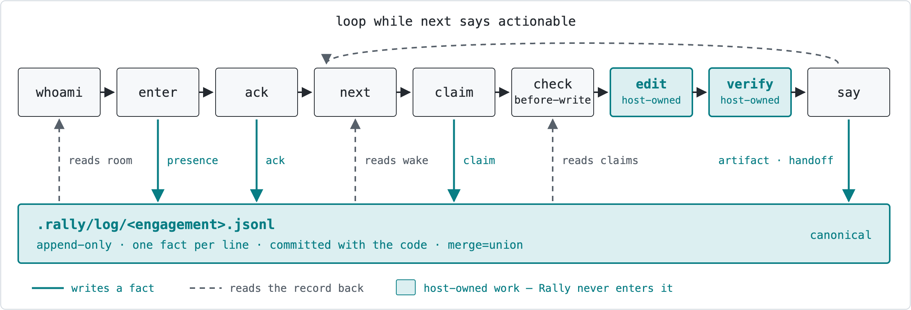
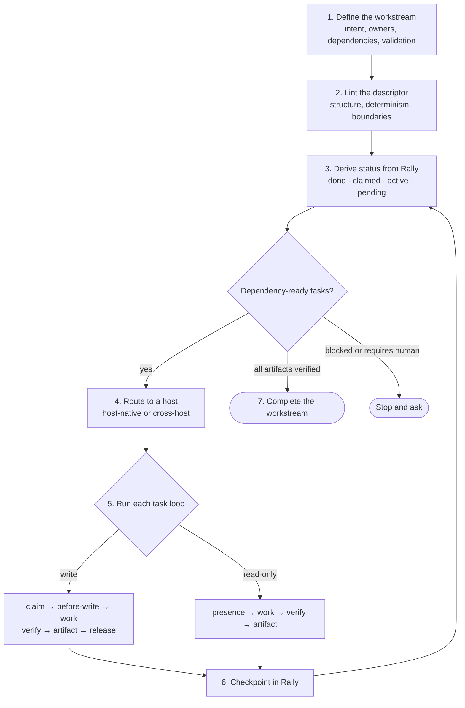

# Agent Rally Point

**Rally gives coding agents a shared record of who owns each task, what changed, and which handoffs were received.** Run agents from different LLMs in one project without relaying every status update yourself.

The `rally` CLI stores coordination facts in a local, append-only ledger. Any harness that can run shell commands can use that protocol: Codex, Claude Code, Gemini, Cursor, RossLabs Agent Harness, or a custom agent. Automatic hooks and direct prompt delivery depend on the host and backend; CLI access alone does not prove either integration works.

## The problem

When several agents work on one project, they need to know who owns a file, where another agent stopped, and whether a requested review reached its recipient. Without a shared record, the operator has to reconstruct that state across conversations.

## How it works

- **Identify the session.** Each agent joins with a distinct identity, reads the current lead and mission, and acknowledges the room's rules. Resolve roles from live state; the lead coordinates assignments and decisions, while each agent reports its own work.
- **Claim before editing.** Rally refuses overlapping exclusive claims. Configured host hooks check file claims before edits. The edit-time check is advisory by default: `rally check before-write` allows the edit with a warning and exits 0; `--strict` makes it exit 4 on a stop finding. Agents must honor refusals; Rally does not lock files against arbitrary writes or make simultaneous edits safe.
- **Record the result.** Agents publish artifacts and verification evidence, then release their claims. Claims expire when their leases are not renewed; managed launches use separate worktrees by default.
- **Verify the handoff.** A receiver-authored receipt proves acknowledgement of the referenced request. Completed work needs a separate result and verification evidence. A successful transport send proves neither.

For example, assign one agent to implement a feature and another to review a separate part of the repo. Each reads the same claims and task results, even if the agents use different model providers.

### The turn loop



For exact command behavior, jump to the [command-level turn-loop reference](#turn-loop-command-reference) below.

Solid arrows write durable coordination facts; dashed arrows read the shared record. The host owns the edit and verification steps.

## Tasks Rally can coordinate

- Run Claude on the UI and Codex on the database at the same time, with more agents reviewing the work and fixing bugs behind them.
- Dispatch a Claude agent from a Codex terminal, or the reverse.
- Run several read-only agents as different personas, all feeding one orchestrator.
- Assign work by model capability: one model judges, one orchestrates, others write the code.
- Split a feature across models, frontend on one and backend on another, then let them integrate and flag the decisions that need you.

## Install with a coding agent (recommended)

The portable baseline is the `rally` CLI plus `rally init`; automatic hooks are host-specific. Paste the prompt below into Claude Code, Codex, Cursor, Gemini, a local model, or any other coding agent that can run shell commands.

**Copy this prompt into your coding agent:**

```text
Install Agent Rally Point from https://github.com/tyroneross/agent-rally-point
for the repository I currently have open.

Follow the repository's AI-agent installation path. Before changing anything,
confirm the target repo and active AI host, run scripts/install-rally.sh --dry-run,
preserve existing CLAUDE.md, AGENTS.md, and host settings, and do not change
user-global configuration without my approval. Then install the CLI, run rally init
only in the target repo, enable only a documented host integration, and verify with
rally doctor --json, rally hooks status, and rally whoami using a unique tool ID.
Report every file changed, every remaining manual step, and any failed validation.
```

Installing the CLI does not enable host hooks or background services. Ask before installing or enabling an optional runtime; explain the feature it enables.

The agent should read the [trust model](docs/security/TRUST-MODEL.md) and [host integration guide](docs/AUTO-COORDINATION-HOOKS.md) before enabling hooks. The CLI protocol works across LLMs; automatic edit interception works only where the host exposes and loads a supported hook interface.

<details>
<summary><strong>Full security-conscious installation prompt</strong></summary>

```text
Install Agent Rally Point from https://github.com/tyroneross/agent-rally-point
for the repository I am currently working in.

Before changing anything:
1. Confirm the target repository, operating system, CPU architecture, active AI host,
   and whether rally, git, gh, cargo, and ~/.local/bin are available. Do not guess if
   the host or target repository is ambiguous.
2. Inspect existing CLAUDE.md, AGENTS.md, and host hook/plugin configuration. Preserve
   unrelated settings and show me which project-local and user-global files would change.
3. Separate the work into three decisions: install the CLI, initialize this repository,
   and optionally enable host-specific automatic hooks. Prefer project-local configuration;
   do not change user-global host configuration without my explicit approval.

Installation rules:
4. Use an existing trusted Rally checkout, or clone the official repository into a stable,
   user-approved location. Run scripts/install-rally.sh --dry-run before installing.
5. Prefer the verified release path, which checks both SHA256 and GitHub build provenance.
   If that cannot run, stop and explain why. Offer scripts/install-rally.sh --source only
   as an explicit alternative; never silently downgrade to an unverified download.
6. Run rally init only in the confirmed target repository. Review its diff. Do not stage,
   commit, or publish the generated Rally files unless I ask.
7. Choose host wiring only from the repository's current documentation. Claude Code,
   Codex, and Cursor have different setup paths; other hosts should use the manual CLI
   loop unless a documented integration exists. Never claim that automatic hooks are
   universal, and never let a lifecycle hook download, build, chmod, or install software.

Verification and handoff:
8. Confirm the installed binary path and version, then run rally doctor --json,
   rally hooks status, and rally whoami --tool <host>:install-check-01 --json from the target repository.
   Use a unique tool ID for every concurrent session.
9. Report: what changed, what stayed manual, whether hooks are advisory or blocking,
   how to disable or uninstall them, any restart required, and any validation that failed.
   Leave unresolved failures visible; do not describe a partial installation as complete.
```

</details>

<details>
<summary><strong>Manual installation and advanced host setup</strong></summary>

**1. Get the CLI.**

```bash
git clone https://github.com/tyroneross/agent-rally-point.git
cd agent-rally-point
RALLY_SOURCE="$(pwd)"
./scripts/install-rally.sh          # --dry-run prints the plan and writes nothing
```

The installer checks a SHA256 and a build-provenance attestation before it makes the
downloaded file executable, and refuses rather than falling back to an unverified download.
The release matrix targets macOS and Linux (GNU), each on ARM64 and x86_64. The verified download path requires `gh`; a failed checksum or attestation stops installation. To build the checked-out source instead, run `cargo install --path crates/rally-cli` (source requires Rust 1.89+; this checkout pins Rust 1.95.0).

**2. Turn it on in the repo your agents share.**

```bash
cd your-repo
rally init
```

That creates `.rally/` and writes instructions into `CLAUDE.md` and `AGENTS.md`. Agents that read those files can discover how to join; other harnesses need the [any-agent onboarding instructions](docs/ANY-AGENT-ONBOARDING.md).

**3. Optionally wire a host for automatic hooks.**

The CLI is enough for a manual pilot. Automatic hooks run code at session start and before edits; Rally assumes one trusted operator on one machine and does not sandbox same-UID agents. Read the [trust model](docs/security/TRUST-MODEL.md) before enabling them.

| Host | Supported setup today |
|------|-----------------------|
| Claude Code | Install the plugin below, or opt into the global hook install from the Rally clone. |
| Codex | Install the plugin for Rally skills. Automatic hooks in another repo require merged project configuration plus the hook script. |
| Cursor | Merge the project hook configuration plus the hook script; path-specific enforcement remains best-effort pending live-host validation. |
| Gemini and other hosts | Use the CLI loop manually. No automatic-hook integration is published today. |

To inspect and then opt into the Claude Code global install, run these from any directory after step 1. They change only `~/.claude/settings.json` and reference the source checkout; they do not copy hook configuration into `your-repo`.

```bash
"$RALLY_SOURCE/scripts/install_rally_hooks.sh" --global --dry-run
"$RALLY_SOURCE/scripts/install_rally_hooks.sh" --global
```

Claude Code users can install the plugin instead, which brings the same hooks plus three
skills:

```bash
claude plugin marketplace add tyroneross/agent-rally-point
claude plugin install agent-rally-point@agent-rally-point
```

For Codex skills, run `codex plugin add agent-rally-point@agent-rally-point --json` and restart Codex. The bundled `.claude/settings.json`, `.codex/hooks.json`, and `.cursor/hooks.json` configure this repository; `rally init` does not copy them—or `hooks/rally-coordination-hook.sh`—into an adopting repository. Merge the configuration you need and copy that hook script into the target before expecting automatic hooks. The exact consumer-repo setup and host limits are in [Auto-Coordination Hooks](docs/AUTO-COORDINATION-HOOKS.md). Any host that can run a shell command can participate through the `rally` CLI with no hooks at all.

**Check it:**

```bash
rally whoami --tool codex:pilot-01 --json
```

Use a distinct `--tool` value for every concurrent session, such as `codex:parser-01` and `claude_code:reviewer-01`; do not copy a bare `codex` identifier into multiple terminals.

</details>

## Verify a first result

After installing `rally`, run this in a **new disposable Git repository**. The two `pilot:` names simulate competing agents; this check needs no LLM or daemon. Each simulated agent keeps its own session ID so it can later release its claim.

```bash
mkdir rally-pilot
cd rally-pilot
git init
rally init
RALLY_PILOT_ID="pilot-$(date +%s)-$$"
RALLY_SESSION_ID="$RALLY_PILOT_ID-writer" rally say claim --tool pilot:writer --path README.md --subject "Review README" --json
# Expected refusal: this second identity requests the same file.
RALLY_SESSION_ID="$RALLY_PILOT_ID-reviewer" rally say claim --tool pilot:reviewer --path README.md --subject "Competing review" --json
RALLY_SESSION_ID="$RALLY_PILOT_ID-reviewer" rally check before-write --tool pilot:reviewer --path README.md --strict --json
rally claims --json
```

The first claim succeeds and returns its `event_id`. The competing claim exits nonzero and reports a claim conflict. The strict check exits **4** and reports `data.check.allow: false`. `rally claims` shows the writer's active claim. No README edit occurs. To release it, run `RALLY_SESSION_ID="$RALLY_PILOT_ID-writer" rally say release --tool pilot:writer --ref <claim-event-id> --subject "Pilot complete" --json`, replacing the placeholder with the first claim's ID.

This proves CLI claim enforcement. To verify an installed host integration, also run `rally doctor --json`, `rally hooks status`, and `rally whoami --tool <unique-session-id> --json` in the target repo. Resolve any ambiguous host identity before proceeding. Then exercise a competing edit through that host: advisory mode should surface a warning; strict mode should refuse it. Configuration files and a successful CLI check alone do not prove that the host loaded its hooks. See the [host integration guide](docs/AUTO-COORDINATION-HOOKS.md) for setup and limits.

## Set up optional runtimes and test routes

```bash
rally setup --component tmux --json  # inspect the installation/check plan
rally setup --component tmux --apply
rally routes --json
```

When tmux is missing, interactive setup asks permission before running its installation plan. An agent should ask: **“Request permission to install tmux to enable background terminal agents.”** After approval, it can apply the exact returned plan ID. An existing supported tmux is reused. Enabling Rally's optional background coordinator also requires approval; setup does not install a login service. tmux sessions do not survive a reboot. There is no automatic ptyd installer in this release path.

`rally routes` distinguishes `polling_only`, `blocked`, `testing_required`, and `ready`. A lead or another authorized sender can test an exact managed recipient:

```bash
rally routes --probe <exact-managed-actor> --tool <sender> --timeout-seconds 20 --json
```

A route becomes `ready` only after current endpoint checks and a matching receiver-authored proof of the live prompt challenge. Ordinary ledger polling, terminal echo and a successful send cannot provide that proof. Proof expires after five minutes and is invalidated by relevant session or role changes. A ready route proves a connection check; verify each task's receipt and result separately.

The stock tmux adapter checks its bound target, copy mode, disabled input and synchronized panes. No customized tmux build ships here. Native Cursor and Antigravity GUI injection still needs host-specific end-to-end validation. See [setup, permissions, process lifetime and route proof](docs/SETUP-AND-ROUTING.md).

## Direct agent-to-agent communication

Rally can launch and message managed coding-agent sessions across supported hosts:

- **`rally run`** launches Claude, Codex, OpenCode, or Gemini through a managed backend. It assigns a unique Rally identity and creates a dedicated linked worktree by default, so the session can be listed, captured, attached to, and stopped predictably.
- **`--resource task:<work-context>`** makes Rally acquire exclusive ownership before `rally run` starts the harness. Host adapters for any other harness can use the same gate with `rally session ensure --resource task:<work-context>` before opening or resuming that context. A conflict fails at the Rally boundary instead of reaching the host's native "open in another app / Retry" state.
- **`rally run codex --task "<prompt>"`** launches bounded Codex work through `codex exec`; Rally feeds the long-lived child over stdin, preserves the final response under `.rally/task-results/`, and automatically closes the session when the task completes. Result files are private local artifacts (mode `0600`) that persist until the operator archives or deletes them; Rally does not apply an automatic retention window. It removes a clean worktree or retains a dirty one with a recovery path. Plain `rally run codex` remains interactive and persistent. The invoking shell may retain the `--task` command in its history.
- **`rally inject`** queues a prompt or recorded handoff for an existing managed session. It does not target arbitrary terminals. A successful inject may only record queued work. Inspect `delivery_reason`, `reached_target` and `queued` to distinguish queuing from a transport send. A correlated acknowledgement from the receiving agent proves receipt; it does not prove task completion.

Inspect the launch plan before starting the session:

```bash
rally run codex --name parser --task "Review the parser and report findings." --resource task:parser-review --dry-run --json
rally run codex --name parser --task "Review the parser and report findings." --resource task:parser-review --json
# Use plain run + inject only when the session must remain open for later steering.
```

Longer handoffs should remain durable in the Rally ledger or a committed handoff document; injection is the focused delivery path. See [Handoffs and Launching Agents](docs/HANDOFFS-AND-LAUNCHING-AGENTS.md) for backend and acknowledgement details.

## Optional tools

Rally needs `git`. Everything else is per-feature.

| Tool | Needed for | Without it |
|------|------------|------------|
| `tmux` | Local fallback backend for managed `run`, `inject`, `attach`, `capture`, and `stop` commands | Use `ptyd` or `cmux` when available; otherwise launch agents yourself and coordinate through the ledger |
| `node` | Rendering the hooks' warning text | Hooks still register presence and claims, and print a one-line notice instead |
| `gh` | `scripts/install-rally.sh`, which verifies the build attestation | Use `cargo install` instead |
| `python3` | Host-surface drift checks for contributors | Nothing user-facing |

## How to use it

Each agent runs the same short loop every turn: join, ask what to do next, claim what it will touch, verify the boundary, work, record the outcome, then release the claim when the resource is free.

<a id="turn-loop-command-reference"></a>

<details>
<summary><strong>Manual turn-loop commands and step reference</strong></summary>

**What each step reads or writes**

| Step | Coordination effect |
|------|---------------------|
| `whoami` | Confirms the host, room, lead, mission, and acknowledgement state before work. It does not append a durable coordination fact. |
| `enter` and `ack` | Write presence and acknowledgement so peers can tell this session has joined under the room's rules. |
| `next` | Reads the room for an actionable recommendation and records the wake intent that makes the next check visible. |
| `claim` | Reserves a file or other resource before shared work begins. Save its returned event ID so it can be released when the lane finishes. |
| `check before-write` | Reads overlapping file claims. It warns by default; `--strict` returns a non-zero exit on a stop finding. |
| `edit` and `verify` | Belong to the coding host. Rally does not perform either action. |
| `say` | Appends a durable outcome: normally an `artifact`, `handoff`, or `resolve`; release the claim after the resource is no longer needed. |

This reference covers command-level behavior, failure modes, and the boundaries between the CLI and the host.

```bash
rally whoami --tool codex:parser-01 --json
rally enter --tool codex:parser-01 --json
rally ack   --tool codex:parser-01
rally next  --tool codex:parser-01 --json
# Save the claim response's event_id as <claim-id>.
rally say claim --tool codex:parser-01 --subject "edit parser" --path crates/rally-cli/src/main.rs --json
rally check before-write --tool codex:parser-01 --path crates/rally-cli/src/main.rs --strict --json
rally say artifact --tool codex:parser-01 --subject "parser hardened" --uri crates/rally-cli/src/main.rs --evidence "cargo test" --json
rally say release  --tool codex:parser-01 --ref <claim-id> --subject "parser lane complete" --json
rally say handoff  --tool codex:parser-01 --target claude_code:docs-reviewer-01 --subject "review docs" --json
rally say resolve  --tool codex:parser-01 --ref <blocker-id> --subject "resolved" --json
rally room --json
```

The `--strict` on `check before-write` above is one of the three blocking switches: it exits 4 when a stop finding is present, so a harness that reads the exit code aborts the write. If it stops the edit, do not edit; coordinate with the holder or release `<claim-id>` before changing lanes. Do not automatically release a claim for an unrelated command failure—diagnose that failure first. Drop `--strict` to get the warning without the non-zero exit.

`rally next` returns `actionable`, `requires_human`, `stop_reason`, `suggested_claims`, `suggested_commands`, and `completion` — enough for a harness to act on its own without turning Rally into a scheduler. Every command takes `--json`.

Resolve handoff targets from live room state (`rally whoami`, `rally lead show`, `rally room --json`), never from examples or old logs.

</details>

### Rally Flow for multi-agent workstreams

The turn loop above is the unit of execution. Rally Flow wraps many of those loops in a linted, dependency-aware workstream whose state can be reconstructed from Rally after a crash or handoff. Rally coordinates the work; the host still launches agents, edits files, and runs verification.



<details>
<summary>What each Rally Flow stage uses</summary>

| Stage | Implemented behavior |
|-------|----------------------|
| Define | A workstream descriptor names task intent, ownership boundaries, dependencies, and validation. |
| Lint | `workstream-lint.mjs` checks structure, deterministic fields, non-overlapping boundaries, dependency integrity, and command safety. |
| Derive | `workstream-status.mjs` reads Rally state and classifies each task as `done`, `claimed`, `active`, or `pending`; dependency-ready tasks become `to_dispatch`. |
| Route | The host uses its native agent launcher by default, or `rally run` plus `rally inject` for cross-host work. Rally records the coordination facts but does not execute the task. |
| Run | Each task follows the write or read-only lifecycle defined by the protocol. The write path uses the turn loop shown above. |
| Checkpoint | Claims, presence, handoffs, and evidence-bearing artifacts make progress durable and reconstructable. |
| Resume or complete | On resume, dispatch only `to_dispatch` tasks and skip tasks with completion artifacts. The coordinator verifies every task's evidence before declaring the workstream complete. |

</details>

The implementation lives in [`dynamic-workflows/`](dynamic-workflows/README.md). See the [Rally Flow protocol](dynamic-workflows/PROTOCOL.md) for lifecycle and resume rules, and the [host-neutral workflow skill](skills/rally-workflows/SKILL.md) for the command mapping.

## Security and host hooks

This repo includes Claude Code, Codex and Cursor hook configurations, plus a plugin hook manifest. A compatible host must load the relevant configuration before automatic checks can run. Adopting repositories need the setup described above; `rally init` alone does not enable hooks. Trusting a host configuration permits its hook code to run.

| Event | What the hook does |
|-------|--------------------|
| SessionStart | Registers presence, reads room state, prints a sanitized summary. Names the install command when `rally` is missing. |
| PreToolUse (edits) | Checks whether another live agent claimed the path. Advisory. |
| UserPromptSubmit | Refreshes idle status. |
| Stop | Records that the write finished. |

The hooks **do not download, build, `chmod`, or install anything**. Provisioning was removed from every lifecycle hook after an external security audit (finding ARP-001). They self-gate on a missing `.rally/`, so they no-op in unrelated repos, and they exit 0 even when Rally is broken.

**Turning them off:**

| Scope | Command |
|-------|---------|
| This session | `RALLY_HOOKS=off` |
| This repo | `rally hooks off --scope repo` |
| Check current state | `rally hooks status` |

Rally **advises by default; three opt-in switches make it block.** In the default posture a failing hook still lets your edit through — PreToolUse returns `permissionDecision: "allow"` with a warning, and every hook exits 0 even when Rally is broken. Setting `RALLY_HOOK_STRICT=1` turns a high-severity collision into a hard deny, `rally check before-write --strict` exits 4 on a stop finding, and `RALLY_BEFORE_WRITE_FAILCLOSED=1` makes that same check exit 4 when it times out. Each is off unless you turn it on.

What the hooks do and what Rally does not defend: [`docs/security/TRUST-MODEL.md`](docs/security/TRUST-MODEL.md).

## What a claim can cover

A claim scope is `type:identifier` with an optional access prefix. Eleven resource types: `workspace`, `repo`, `file`, `dir`, `branch`, `commit`, `port`, `process`, `service`, `task`, `cross-repo`. Four access modes: `exclusive`, `shared_read`, `advisory`, `namespace` — `exclusive` is the default for most types; `dir`, `repo`, and `workspace` default to `namespace` (source: `crates/rally-cli/src/resource_scope.rs`). So an agent about to reset the shared database claims the service, not a file:

```bash
rally say claim --tool claude_code --subject "resetting dev db" --scope service:postgres-dev --json
```

While that claim is live, another agent's overlapping claim is refused at write time — the command exits nonzero:

```text
claim conflict: claude_code holds service:postgres-dev (claim fact_...), which overlaps the scope you requested
```

**The boundary:** `rally check before-write` is path-based — it takes `--path` and builds a `file:` scope — so the automatic PreToolUse hook deconflicts files only. A non-file resource is protected at claim time: the competing claim is refused, and the refusal names the holder, so an agent that claims before acting backs off. An agent that touches the database without claiming it is not checked by anything.

## Room signal

`rally room` shows **human coordination risks only**. System telemetry — `unmanaged-agent`, `duplicate-active-squad-id`, `binary-drift`, `external-intake` — projects into a separate subject-deduped `system_health` bucket (surfaced as `system_health=N`), so the risk view stays worth reading. Read one kind at a time instead of hand-parsing JSON:

```bash
rally risks --json        # human coordination risks only
rally decisions --json
rally artifacts --json
rally claims --json
```

## Managed sessions

```bash
rally run claude                                  # becomes claude-01, tool claude_code:01
rally run claude --backend <auto|tmux|cmux|ptyd|ptyd-strict>
rally run claude --resource task:<work-context>   # admission before launch
# auto = ptyd if live, else tmux; ptyd-strict refuses any mux fallback
rally inject <session|name|tool> --handoff <event-id> --json
```

### Try two managed agents

Use an initialized repo with an initial Git commit and the required harnesses installed and signed in. Inspect each launch with `--dry-run --json` first. Check the generated identity and worktree path, then run:

```bash
rally run claude --name readme-review
rally run codex --name test-review --task "Read CONTRIBUTING.md and the test configuration. Report the documented verification commands and any mismatch. Do not edit files."
rally sessions --json
```

Give the interactive Claude session this task: “Read README.md. Report up to three unclear installation steps with line references. Do not edit files.” Use equivalent repository documents if these files are absent.

The sessions listing proves registration. Read both agents' final reports to verify the requested work; the bounded Codex task also records its final response under `.rally/task-results/`. To test a cross-agent handoff, resolve the recipient from live state and follow the [handoff receipt procedure](docs/HANDOFFS-AND-LAUNCHING-AGENTS.md). Do not treat launch success, terminal text or `inject` success as evidence that an agent accepted the task.

Use `--shared` or `--no-worktree` only when you intend a shared checkout. Agents still claim and check files before editing.

## Where the record lives

- **One repo, one rally point.** Coordination lives at `<repo_root>/.rally/`, never co-mingled across repos. Linked git worktrees share one room through the git common dir.
- **`.rally/log/<engagement>.jsonl` is canonical local history** — append-only and replayable. This release repo ignores live logs and commits only `.rally/manifest.json`, so a fresh clone begins with an empty room. If your project chooses to commit logs, review them as agent-steering content and configure their merge policy deliberately. `.rally/facts.db` is a derived SQLite cache, rebuilt by replaying the local log when it is missing or behind.
- **Room state is derived on demand**, so no live server state can be lost.
- **Network transport is out of scope.** Files, Git, rsync, or a shared folder move the facts; Rally defines what the bytes mean.

## Design tradeoffs

These choices set the coordination boundary. [`docs/DESIGN-TRADEOFFS.md`](docs/DESIGN-TRADEOFFS.md) records what was tried, what broke, and what was chosen:

- **Hooks reduce reliance on agents remembering each check.** A configured host calls Rally at defined events. That adds executable code to the host; it does not establish a measured compliance rate across all agents.
- **Agents self-manage; a manager agent was rejected.** A manager would turn the substrate into a scheduler and a single point of failure. Rally fixed the observability that made silence ambiguous instead — mandated check-ins, worktree isolation for no-shows, lease expiry on claims.
- **Rally gates ownership but does not choose the next harness.** An explicit `--resource` request is an atomic admission check. The host still decides what to launch, whether to wait, and where to redirect after Rally grants ownership.
- **Use live delivery where tested, and polling where it is unavailable.** The ledger retains the handoff; a route check establishes whether a managed recipient can receive a live prompt.

## Security and maturity

Rally assumes **one operator, on one machine, running agents you started yourself.** Every agent runs as your UID, so Rally coordinates them and cannot sandbox them — a coordination layer cannot be a privilege boundary between processes that all hold your privileges.

If a second contributor can land commits in your repo, read the trust model first. If you choose to commit `.rally/log/*.jsonl`, those facts replay on clone and carry no signature, so review them as agent-steering content just as you review code. Rally's own release repo keeps live logs local; fresh clones start with its manifest and an empty room.

The [trust model](docs/security/TRUST-MODEL.md) documents the concrete boundary: Rally coordinates trusted local processes and does not turn same-UID agents into mutually isolated principals. Security-sensitive behavior is covered by executable tests in the repository so contributors can inspect and extend the controls.

**Maturity, stated plainly:** Rally runs daily on a small number of fresh macOS installs driven by one operator. It is not proven on Linux beyond CI, across every harness or editor GUI, or with more than one human. Expect edge cases outside that envelope.

## Start here

- [`RALLY.md`](RALLY.md) — the 60-second operating guide. Read this first.
- [`docs/RALLY_ARCHITECTURE.md`](docs/RALLY_ARCHITECTURE.md) — per-repo segmentation contract and product boundary.
- [`docs/SETUP-AND-ROUTING.md`](docs/SETUP-AND-ROUTING.md) — runtime permission, process lifetime and connection checks.
- [`docs/COMMAND-SEMANTICS.md`](docs/COMMAND-SEMANTICS.md) — read/write behavior per command.
- [`docs/AUTO-COORDINATION-HOOKS.md`](docs/AUTO-COORDINATION-HOOKS.md) — how the host hook wiring works.
- [`dynamic-workflows/PROTOCOL.md`](dynamic-workflows/PROTOCOL.md) — the workstream descriptor for fanning several agents out on one objective.
- [`CONTRIBUTING.md`](CONTRIBUTING.md) — development setup and the verification bar.

## Keeping hosts on one release

Rally generates every host manifest, hook setting, skill frontmatter, and packaged Codex artifact from `config/host-integrations.json` plus the CLI version in `crates/rally-cli/Cargo.toml`. Generated files carry the same release identity and content digest, and the release gate rejects drift.

```bash
python3 scripts/generate_host_surfaces.py --check
python3 scripts/sync_host_integrations.py --json          # read-only diagnosis
python3 scripts/sync_host_integrations.py --apply --json  # reconcile installed hosts
```

The reconciler manages installed plugin providers; it does not maintain hook scripts manually copied into adopting repositories. Review and merge those project-local copies when upgrading, preserve unrelated settings, and repeat the host activation check.

The reconciler requires exactly one enabled provider per host. It removes stale duplicates, updates from the canonical marketplace, and reports when Claude Code or Codex must restart to load new content. It changes nothing without `--apply`.

Published releases remain immutable. New versions reconcile the CLI, generated host surfaces, and marketplace artifacts from the same canonical integration configuration.

## Verification

Rust is the acceptance path, and the pre-push gate runs it:

```bash
cargo fmt --all -- --check
cargo clippy --all-targets -- -D warnings
cargo test --all
git diff --check
```

Primary code must compile on Rust 1.89 (the MSRV in `Cargo.toml`). These verification commands themselves run under the exact toolchain `rust-toolchain.toml` pins (1.95.0) — `cargo fmt --check` needs a matching `rustfmt` build or its diff is meaningless.

## License

Apache-2.0 — see [`LICENSE`](LICENSE) and [`NOTICE`](NOTICE).
