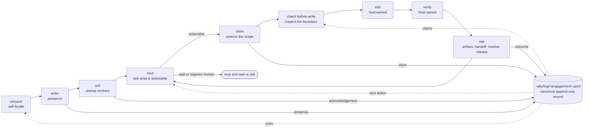

# Agent Rally Point

**Rally Point solves multi-agent coordination in local repos. Every agent shares who it is, what it is working on, and its status on one shared ledger per repo, so agents using any coding harness can exchange durable coordination facts in that repo.**

Rally Point works across terminals and LLMs, so multiple Claude and Codex agents can work independently in one repo and coordinate access to the same file. Claims serialize conflicting writes; Rally does not make simultaneous edits to one file safe. The ledger and protocol work with any coding harness that can invoke the CLI, including local models, Cursor, Herdr, and Ghostty.

## The problem

Working with more than one coding agent means moving between them by hand. A shared memory store and handoff docs help, but the process stays manual and the work stays sequential: Claude works, then you hand off to Codex.

Run them at the same time instead and they overwrite each other's uncommitted work, so you go back to taking turns.

## How it works

Every terminal session gets a unique ID and writes to the rally when it starts working, naming the file, the task, and its state. An agent that joins later sees what is already being worked on, and claims the files it will edit. An agent that wants a claimed file can ask the owner to release it, or message that agent directly.

Each rally also has a lead, usually the first frontier agent to join. The lead resolves conflicts between the others.

- **A claim covers more than a file.** It can name the dev database, a port, a branch, or a task.
- **The check runs automatically before an edit.** It warns by default; three opt-in switches make it block instead.
- **The ledger is append-only and repo-local.** A project can deliberately commit it, but Rally's own release repo keeps live coordination history local so fresh clones begin with an empty room.
- **Agents that leave don't hold the repo hostage.** Claims decay on a lease, and leftover work is isolated in its own worktree.

Agents also hand work to each other, and a handoff is complete only when the receiving agent writes its own acknowledgement.

## What people use it for

- Run Claude on the UI and Codex on the database at the same time, with more agents reviewing the work and fixing bugs behind them.
- Dispatch a Claude agent from a Codex terminal, or the reverse.
- Run several read-only agents as different personas, all feeding one orchestrator.
- Assign work by model capability: one model judges, one orchestrates, others write the code.
- Split a feature across models, frontend on one and backend on another, then let them integrate and flag the decisions that need you.

## Install

**1. Get the CLI.**

```bash
git clone https://github.com/tyroneross/agent-rally-point.git
cd agent-rally-point
RALLY_SOURCE="$(pwd)"
./scripts/install-rally.sh          # --dry-run prints the plan and writes nothing
```

The installer checks a SHA256 and a build-provenance attestation before it makes the
downloaded file executable, and refuses rather than falling back to an unverified download.
To build it yourself instead, run `cargo install --path crates/rally-cli` (needs Rust 1.89+).

**2. Turn it on in the repo your agents share.**

```bash
cd your-repo
rally init
```

That creates `.rally/` and writes a pointer into your `CLAUDE.md` and `AGENTS.md`, so any
agent that opens the repo knows how to join.

**3. Optionally wire a host for automatic hooks.**

The CLI is enough for a manual pilot. Automatic hooks run code at session start and before edits; Rally assumes one trusted operator on one machine and does not sandbox same-UID agents. Read the [trust model](docs/security/TRUST-MODEL.md) before enabling them.

| Host | Supported setup today |
|------|-----------------------|
| Claude Code | Install the plugin below, or opt into the global hook install from the Rally clone. |
| Codex | Install the plugin for Rally skills. Automatic hooks in another repo require merged project configuration plus the hook script. |
| Cursor | Merge the project hook configuration plus the hook script; path-specific enforcement remains best-effort pending live-host validation. |
| Gemini and other hosts | Use the CLI loop manually. No automatic-hook integration is published today. |

To inspect and then opt into the Claude Code global install, run these from any directory after step 1. They change only `~/.claude/settings.json` and reference the source checkout; they do not copy hook configuration into `your-repo`.

```bash
"$RALLY_SOURCE/scripts/install_rally_hooks.sh" --global --dry-run
"$RALLY_SOURCE/scripts/install_rally_hooks.sh" --global
```

Claude Code users can install the plugin instead, which brings the same hooks plus three
skills:

```bash
claude plugin marketplace add tyroneross/agent-rally-point
claude plugin install agent-rally-point@agent-rally-point
```

For Codex skills, run `codex plugin add agent-rally-point@agent-rally-point --json` and restart Codex. The bundled `.claude/settings.json`, `.codex/hooks.json`, and `.cursor/hooks.json` configure this repository; `rally init` does not copy them—or `hooks/rally-coordination-hook.sh`—into an adopting repository. Merge the configuration you need and copy that hook script into the target before expecting automatic hooks. The exact consumer-repo setup and host limits are in [Auto-Coordination Hooks](docs/AUTO-COORDINATION-HOOKS.md). Any host that can run a shell command can participate through the `rally` CLI with no hooks at all.

**Check it:**

```bash
rally whoami --tool codex:pilot-01 --json
```

Use a distinct `--tool` value for every concurrent session, such as `codex:parser-01` and `claude_code:reviewer-01`; do not copy a bare `codex` identifier into multiple terminals.

## Optional tools

Rally needs `git`. Everything else is per-feature.

| Tool | Needed for | Without it |
|------|------------|------------|
| `tmux` | `rally run` and `rally inject`, which launch and message managed sessions | Agents still coordinate through the ledger; you launch them yourself |
| `node` | Rendering the hooks' warning text | Hooks still register presence and claims, and print a one-line notice instead |
| `gh` | `scripts/install-rally.sh`, which verifies the build attestation | Use `cargo install` instead |
| `python3` | Host-surface drift checks for contributors | Nothing user-facing |

## Opening this repo runs its hooks

This repo commits hook registrations for four hosts: `.claude/settings.json`, `.codex/hooks.json`, `.cursor/hooks.json`, and `hooks/hooks.json`. **Opening the repo in one of those hosts and trusting it loads those hooks.** That is the intended design and the reason coordination needs no setup step. It is also a trust decision, so here is what runs.

| Event | What the hook does |
|-------|--------------------|
| SessionStart | Registers presence, reads room state, prints a sanitized summary. Names the install command when `rally` is missing. |
| PreToolUse (edits) | Checks whether another live agent claimed the path. Advisory. |
| UserPromptSubmit | Refreshes idle status. |
| Stop | Records that the write finished. |

The hooks **do not download, build, `chmod`, or install anything**. Provisioning was removed from every lifecycle hook after an external security audit (finding ARP-001). They self-gate on a missing `.rally/`, so they no-op in unrelated repos, and they exit 0 even when Rally is broken.

**Turning them off:**

| Scope | Command |
|-------|---------|
| This session | `RALLY_HOOKS=off` |
| This repo | `rally hooks off --scope repo` |
| Check current state | `rally hooks status` |

Rally **advises by default; three opt-in switches make it block.** In the default posture a failing hook still lets your edit through — PreToolUse returns `permissionDecision: "allow"` with a warning, and every hook exits 0 even when Rally is broken. Setting `RALLY_HOOK_STRICT=1` turns a high-severity collision into a hard deny, `rally check before-write --strict` exits 4 on a stop finding, and `RALLY_BEFORE_WRITE_FAILCLOSED=1` makes that same check exit 4 when it times out. Each is off unless you turn it on.

What the hooks do and what Rally does not defend: [`docs/security/TRUST-MODEL.md`](docs/security/TRUST-MODEL.md).

## How to use it

Each agent runs the same short loop every turn: join, ask what to do next, claim what it will touch, verify the boundary, work, record the outcome, then release the claim when the resource is free.

### The turn loop



Rally records and reads coordination facts; the host owns the edit and the verification. A
handoff is complete only when the receiving agent writes its own acknowledgement.

<details>
<summary>What each step reads or writes</summary>

| Step | Coordination effect |
|------|---------------------|
| `whoami` | Confirms the host, room, lead, mission, and acknowledgement state before work. It does not append a durable coordination fact. |
| `enter` and `ack` | Write presence and acknowledgement so peers can tell this session has joined under the room's rules. |
| `next` | Reads the room for an actionable recommendation and records the wake intent that makes the next check visible. |
| `claim` | Reserves a file or other resource before shared work begins. Save its returned event ID so it can be released when the lane finishes. |
| `check before-write` | Reads overlapping file claims. It warns by default; `--strict` returns a non-zero exit on a stop finding. |
| `edit` and `verify` | Belong to the coding host. Rally does not perform either action. |
| `say` | Appends a durable outcome: normally an `artifact`, `handoff`, or `resolve`; release the claim after the resource is no longer needed. |

</details>

For command-level behavior, failure modes, and the boundaries between the CLI and the host, read the [turn-loop contract](docs/TURN-LOOP.md).

```bash
rally whoami --tool codex:parser-01 --json
rally enter --tool codex:parser-01 --json
rally ack   --tool codex:parser-01
rally next  --tool codex:parser-01 --json
# Save the claim response's event_id as <claim-id>.
rally say claim --tool codex:parser-01 --subject "edit parser" --path crates/rally-cli/src/main.rs --json
rally check before-write --tool codex:parser-01 --path crates/rally-cli/src/main.rs --strict --json
rally say artifact --tool codex:parser-01 --subject "parser hardened" --uri crates/rally-cli/src/main.rs --evidence "cargo test" --json
rally say release  --tool codex:parser-01 --ref <claim-id> --subject "parser lane complete" --json
rally say handoff  --tool codex:parser-01 --target claude_code:docs-reviewer-01 --subject "review docs" --json
rally say resolve  --tool codex:parser-01 --ref <blocker-id> --subject "resolved" --json
rally room --json
```

The `--strict` on `check before-write` above is one of the three blocking switches: it exits 4 when a stop finding is present, so a harness that reads the exit code aborts the write. If it stops the edit, do not edit; coordinate with the holder or release `<claim-id>` before changing lanes. Do not automatically release a claim for an unrelated command failure—diagnose that failure first. Drop `--strict` to get the warning without the non-zero exit.

`rally next` returns `actionable`, `requires_human`, `stop_reason`, `suggested_claims`, `suggested_commands`, and `completion` — enough for a harness to act on its own without turning Rally into a scheduler. Every command takes `--json`.

Resolve handoff targets from live room state (`rally whoami`, `rally lead show`, `rally room --json`), never from examples or old logs.

## What a claim can cover

A claim scope is `type:identifier` with an optional access prefix. Eleven resource types: `workspace`, `repo`, `file`, `dir`, `branch`, `commit`, `port`, `process`, `service`, `task`, `cross-repo`. Four access modes: `exclusive`, `shared_read`, `advisory`, `namespace` — `exclusive` is the default for most types; `dir`, `repo`, and `workspace` default to `namespace` (source: `crates/rally-cli/src/resource_scope.rs`). So an agent about to reset the shared database claims the service, not a file:

```bash
rally say claim --tool claude_code --subject "resetting dev db" --scope service:postgres-dev --json
```

While that claim is live, another agent's overlapping claim is refused at write time — the append fails with exit 2:

```text
claim conflict: claude_code holds service:postgres-dev (claim fact_...), which overlaps the scope you requested
```

**The boundary:** `rally check before-write` is path-based — it takes `--path` and builds a `file:` scope — so the automatic PreToolUse hook deconflicts files only. A non-file resource is protected at claim time: the competing claim is refused, and the refusal names the holder, so an agent that claims before acting backs off. An agent that touches the database without claiming it is not checked by anything.

## Room signal

`rally room` shows **human coordination risks only**. System telemetry — `unmanaged-agent`, `duplicate-active-squad-id`, `binary-drift`, `external-intake` — projects into a separate subject-deduped `system_health` bucket (surfaced as `system_health=N`), so the risk view stays worth reading. Read one kind at a time instead of hand-parsing JSON:

```bash
rally risks --json        # human coordination risks only
rally decisions --json
rally artifacts --json
rally claims --json
```

## Managed sessions

```bash
rally run claude                                  # becomes claude-01, tool claude_code:01
rally run claude --backend <auto|tmux|cmux|ptyd>  # auto = ptyd if live, else tmux
rally inject <session|name|tool> --handoff <event-id> --json
```

### Five-minute two-agent pilot

From an initialized target repository, inspect the launch plan first. `rally run` gives each managed agent a unique tool id and a dedicated linked worktree by default.

```bash
rally run claude --name ui-review --dry-run --json
rally run codex  --name parser --dry-run --json
```

Check `data.run.session.tool` and `worktree_path` in each response, then launch only the agents you intend to use:

```bash
rally run claude --name ui-review
rally run codex  --name parser
rally sessions --json
```

Use `--shared` or `--no-worktree` only when you deliberately want a shared checkout. Agents still claim and check files before editing, and a receiver's own ACK—not a successful `rally inject` exit code—proves a handoff was received.

**`rally inject` returns `ok: true` when a message is enqueued, which is not the same as delivered.** The receive side has no resident owner yet (RC-001 in the register). Treat the target's own ACK as proof, not the inject's exit code.

## Where the record lives

- **One repo, one rally point.** Coordination lives at `<repo_root>/.rally/`, never co-mingled across repos. Linked git worktrees share one room through the git common dir.
- **`.rally/log/<engagement>.jsonl` is canonical local history** — append-only and replayable. This release repo ignores live logs and commits only `.rally/manifest.json`, so a fresh clone begins with an empty room. If your project chooses to commit logs, review them as agent-steering content and configure their merge policy deliberately. `.rally/facts.db` is a derived SQLite cache, rebuilt by replaying the local log when it is missing or behind.
- **Room state is derived on demand**, so no live server state can be lost.
- **Network transport is out of scope.** Files, Git, rsync, or a shared folder move the facts; Rally defines what the bytes mean.

## Design tradeoffs

Three decisions shape everything above, and each cost something. [`docs/DESIGN-TRADEOFFS.md`](docs/DESIGN-TRADEOFFS.md) records what was tried, what broke, and what was chosen:

- **Hooks beat a hookless CLI.** Instructing agents to run the commands produced inconsistent compliance that failed silently, because a missed check looks identical to a repo where nobody else is working. Hooks made compliance near-universal and made the repo more intrusive.
- **Agents self-manage; a manager agent was rejected.** A manager would turn the substrate into a scheduler and a single point of failure. Rally fixed the observability that made silence ambiguous instead — mandated check-ins, worktree isolation for no-shows, lease expiry on claims.
- **Push where available, pull as the floor.** Direct pane delivery arrives now and lets two agents argue a design question in real time. The ledger is what the protocol guarantees.

## Security and maturity

Rally assumes **one operator, on one machine, running agents you started yourself.** Every agent runs as your UID, so Rally coordinates them and cannot sandbox them — a coordination layer cannot be a privilege boundary between processes that all hold your privileges.

If a second contributor can land commits in your repo, read the trust model first. If you choose to commit `.rally/log/*.jsonl`, those facts replay on clone and carry no signature, so review them as agent-steering content just as you review code. Rally's own release repo keeps live logs local; fresh clones start with its manifest and an empty room.

An independent audit (issue #52) produced seven findings in August 2026: three Critical, one High, two Medium, one Low. Six are closed with tests that fail when the fix is reverted. One — Cockpit's approval gate, which observes tool calls but does not stop them — has a documented fail-safe and an open redesign. Per-finding disposition: [`docs/security/AUDIT-2026-08-02-issue-52-triage.md`](docs/security/AUDIT-2026-08-02-issue-52-triage.md). Known open defects live in [`docs/ROOT-CAUSE-REGISTER.md`](docs/ROOT-CAUSE-REGISTER.md), where an entry closes only once an adversarial test proves the control fires.

**Maturity, stated plainly:** Rally runs daily on a small number of fresh macOS installs driven by one operator. It is not proven on Linux beyond CI, on hosts other than the four wired here, or with more than one human. Expect edge cases outside that envelope.

## Start here

- [`RALLY.md`](RALLY.md) — the 60-second operating guide. Read this first.
- [`docs/RALLY_ARCHITECTURE.md`](docs/RALLY_ARCHITECTURE.md) — per-repo segmentation contract and product boundary.
- [`docs/COMMAND-SEMANTICS.md`](docs/COMMAND-SEMANTICS.md) — read/write behavior per command.
- [`docs/AUTO-COORDINATION-HOOKS.md`](docs/AUTO-COORDINATION-HOOKS.md) — how the host hook wiring works.
- [`dynamic-workflows/PROTOCOL.md`](dynamic-workflows/PROTOCOL.md) — the workstream descriptor for fanning several agents out on one objective.
- [`CONTRIBUTING.md`](CONTRIBUTING.md) — development setup and the verification bar.

## Keeping hosts on one release

Rally generates every host manifest, hook setting, skill frontmatter, and packaged Codex artifact from `config/host-integrations.json` plus the CLI version in `crates/rally-cli/Cargo.toml`. Generated files carry the same release identity and content digest, and the release gate rejects drift.

```bash
python3 scripts/generate_host_surfaces.py --check
python3 scripts/sync_host_integrations.py --json          # read-only diagnosis
python3 scripts/sync_host_integrations.py --apply --json  # reconcile installed hosts
```

The reconciler requires exactly one enabled provider per host. It removes stale duplicates, updates from the canonical marketplace, and reports when Claude Code or Codex must restart to load new content. It changes nothing without `--apply`.

The public `v0.2.1` release remains immutable; `v0.2.5` is prepared as its replacement release. The [release playbook](docs/RELEASING.md) separates GitHub Release assets, generated host marketplace surfaces, and any legacy GitHub Package that needs a separate update.

## Verification

Rust is the acceptance path, and the pre-push gate runs it:

```bash
cargo fmt --all -- --check
cargo clippy --all-targets -- -D warnings
cargo test --all
git diff --check
```

Primary code must compile on Rust 1.89 (the MSRV in `Cargo.toml`). These verification commands themselves run under the exact toolchain `rust-toolchain.toml` pins (1.95.0) — `cargo fmt --check` needs a matching `rustfmt` build or its diff is meaningless.

### Commit identity

`.githooks/pre-commit` and `.githooks/pre-push` refuse a commit whose author or committer is not on `config/git-identity-allowlist.txt`. Both stay silent when your identity is correct, and they read only the author and committer fields — a `Co-Authored-By:` trailer naming an AI model is the documented convention here and passes untouched. Set your identity globally and add yourself to the allowlist in your PR; [`CONTRIBUTING.md`](CONTRIBUTING.md) has the four rejected address shapes and the one-line fix for a repo-local override. The defect that motivated the gate is [`docs/ROOT-CAUSE-REGISTER.md`](docs/ROOT-CAUSE-REGISTER.md) RC-064.

## License

Apache-2.0 — see [`LICENSE`](LICENSE) and [`NOTICE`](NOTICE).
