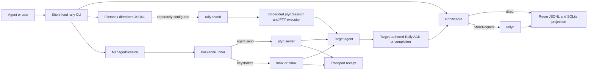

<!-- markdownlint-disable MD013 -->
<!-- SPDX-FileCopyrightText: 2026 Tyrone Ross, Jr <46267523+tyroneross@users.noreply.github.com> -->
<!-- SPDX-License-Identifier: Apache-2.0 -->

# Daemon and Transport Architecture

> **Status:** source-grounded current architecture plus proposed delivery-router contract.
> **Rally baseline:** `97f5034` on 2026-08-08. Unrelated working-tree changes were excluded.
> **ptyd baseline:** sibling repository at `6360899` on 2026-08-08. Its unrelated working-tree
> changes were excluded.
> **Related decisions:** [`ROUTER-ARCHITECTURE.md`](ROUTER-ARCHITECTURE.md) defines the product
> direction. [`ROUTER-DEPENDENCY-MAP.md`](ROUTER-DEPENDENCY-MAP.md) defines the dependency changes
> and regression blast radius.

## Purpose

This document defines what each long-running process does, what enters and leaves it, what state it
owns, how the processes interact, and where delivery evidence changes meaning. It separates current
implementation from proposed behavior so a future implementation does not accidentally merge
storage, routing, process control, and application-session responsibilities.

## Executive architecture

The recommended design keeps three internal processes because they have different privileges and
failure domains, while exposing one Rally service lifecycle to the user:

```text
rally service
  ├── rallyd          canonical repository-state serialization
  ├── rally-routerd   proposed delivery ownership and adapter selection
  └── ptyd            optional process/PTY runtime, started only when needed
```

`rally-termd` is an existing external inbox-to-PTY consumer. It supplies useful subscriber and
deduplication logic, but it cannot remain an autonomous consumer in a room after `rally-routerd`
becomes authoritative. `cockpitd` remains a separate app-facing session server.

## Naming and responsibility boundaries

| Name | Current or proposed | Precise meaning |
| --- | --- | --- |
| `rallyd` | Current | Per-repository single-writer server for `RoomStore` operations |
| `RoomStore::route` | Current internal method | Chooses direct store access or `rallyd`; it does not select a delivery transport |
| `ptyd` | Current sibling service | Owns terminal sessions, child processes, panes, input, output, and Rally-identity-to-pane bindings |
| `rally-termd` / `terminal-rally-point` | Current sibling service | Watches Rally `FileInbox` logs and converts authorized directives into PTY actions |
| `cockpitd` | Current | WebSocket app server and agent-session supervisor with its own SQLite state |
| `rally-routerd` | Proposed | Sole Rally-owned consumer that resolves endpoints, selects adapters, leases attempts, and resumes delivery |
| `DeliveryPlanner` | Proposed pure library | Deterministically chooses or rejects a route from message, endpoint, policy, and attempt inputs |

The file `crates/rally-cli/src/daemon_client.rs` currently talks to `ptyd`, not `rallyd`. Rename it
to `ptyd_client.rs` when the router work begins. Existing comments that call `ptyd` or
`agent.register` the “rally-termd daemon” should also be corrected because `ptyd` and
`rally-termd` are distinct processes.

## Current topology



### Current process matrix

| Process | Scope | Starts it | Primary input | Primary output | Durable state | Network/process authority |
| --- | --- | --- | --- | --- | --- | --- |
| `rallyd` | One repository | `rally daemon start`, `rally daemon serve`, or `rallyd` | One line-delimited `StoreRequest` per Unix-socket connection | One `StoreResponse` line | Canonical room segments, SQLite projection, socket address, PID, log | No external process, agent, model, or network authority |
| `ptyd` | One local runtime socket | Easy Terminal, `ptyd server`, or Rally autostart path | JSON RPC-like request `{id,method,params}` | JSON result/error; raw or snapshot streams for subscriptions | Session tree, pane history, identity bindings, event/session records | Owns PTYs and child processes; optional feature-gated remote transport |
| `rally-termd` | One configured Rally ledger and roster | Operator or external service manager | `Directive` records from per-agent `FileInbox` files | Embedded-session PTY action, per-agent `Receipt`, heartbeat receipt, high-water mark | PID lock and `last_acted_seq/<agent>` | Embeds a `ptyd` `Session`; no provider-neutral route selection |
| `cockpitd` | One app server | Operator or LaunchAgent | Authenticated WebSocket `ClientCommand` | Normalized `ServerEvent` stream | Separate session/event/approval SQLite and audit SQLite | Spawns configured agent CLI; serves WebSocket clients |
| `rally-routerd` | One repository, proposed | `rally service start` | Pending envelopes, endpoints, policy, attempts, ACKs | Route plans, adapter calls, attempt evidence, retry/queued decisions | Rally delivery state plus worker lease/cursor | Calls adapters; never owns PTYs or canonical storage |

## Shared data and wire surfaces

| Surface | Producer | Consumer | Shape | Meaning |
| --- | --- | --- | --- | --- |
| `.rally/log/<engagement>.jsonl` | `RoomStore` direct or through `rallyd` | Rally projections and readers | Canonical `Fact` records | Coordination source of truth |
| `.rally/facts.db` | `DirectRoomStore`, serialized by `rallyd` when active | Rally queries and projections | SQLite projection | Rebuildable operational projection, not transport |
| `.rally/inbox/<agent>.jsonl` | `FileInbox::append_directive` | Agent pull, `rally-termd`, proposed router | `Directive` JSONL | Durable per-recipient delivery intent |
| `.rally/receipts/<agent>.jsonl` | `rally-termd` or another inbox consumer | Rally status/readers | `Receipt` JSONL | Consumer-reported outcome for one directive |
| `.rally/rallyd.sock.addr` | `rallyd` | Routed store client | Socket-path text | Sole `rallyd` discovery pointer |
| `rallyd` Unix socket | Routed store client | `rallyd` | One `StoreRequest` line, one `StoreResponse` line | Store operation only |
| `PTYD_SOCKET_PATH` or default ptyd socket | Rally/Easy Terminal clients | `ptyd` | `{id,method,params}` line and result/error line | Runtime/process/terminal operation |
| `rally-termd` state root | `rally-termd` | Same process after restart | PID plus one sequence file per agent | Single-instance control and delivery deduplication |
| `cockpitd` WebSocket | iOS/CLI client | `cockpitd` | `ClientCommand` and `ServerEvent`, tagged by `t` | App session control and event replay |

`FileInbox` already creates private `inbox/` and `receipts/` directories, allocates monotonic
per-agent sequence numbers under a bounded file lock, bounds frames, repairs an incomplete tail,
syncs appends, and uses `(to, seq)` as the delivery deduplication key. The proposed router must
extend this path instead of introducing a second pending queue.

## Current interaction logic

### Canonical store operation

```text
caller
  -> RoomStore method
  -> RoomStore::route
      -> DirectRoomStore when no compatible rallyd owns the room
      OR
      -> RoutedRoomStore
          -> connect to path read from .rally/rallyd.sock.addr
          -> write StoreRequest { wire_version, engagement, op } + newline
          -> read one StoreResponse + newline
          -> reconstruct the local result or typed error
```

The caller resolves `engagement`; `rallyd` does not infer it from its own environment. A `Ping`
returns canonical repository root, daemon PID, and wire version so the client can reject a wrong
repository or incompatible server.

### Current managed-session send

```text
rally inject
  -> resolve one ManagedSession
  -> append coordination Fact when the command carries text
  -> append Directive to FileInbox
  -> inspect ManagedSession.backend and daemon_registered
      -> ptyd: agent.send {to,text,submit:true,confirm:"sent"}
      -> tmux/cmux: framed keystroke injection plus capture verification
  -> record sender-observed transport evidence
  -> optionally wait for a target-authored Rally resolution
```

The CLI deliberately requests `confirm:"sent"` from `ptyd`. That result proves the write contract
completed without waiting for an echo. It does not prove the target accepted or completed the work.
The CLI also cross-checks the returned `pane_id` against the pane pinned in `ManagedSession`; a
mismatch fails without fallback.

### Existing asynchronous inbox-to-PTY send

```text
rally-termd subscriber for agent A
  -> wake on file event or recovery poll
  -> FileInbox.read_since(A, in_memory_high)
  -> for each seq above high-water:
      -> RegisteredPolicy.authorize(Directive)
      -> DeliveryExecutor.deliver/read/stop
      -> append success or failed Receipt
      -> atomically persist last_acted_seq/A
      -> update in-memory high-water
```

A missing high-water file does not replay the entire historical inbox. The subscriber baselines to
the current maximum sequence and acts only on later directives. `rally-termd` also writes a
dedicated heartbeat receipt with a per-run nonce. Its production binary requires explicit
`--ledger`, `--state`, and at least one `--agent`; auto-discovery is not implemented.

### Semantic completion

```text
transport result
  != target ACK
  != work started
  != completion

target agent
  -> writes correlated ACK / progress / blocker / completion to Rally
  -> RoomStore records canonical fact
  -> waiting sender or later observer reads it
```

This distinction is mandatory across every current and proposed transport.

## `rallyd` contract

### `ptyd` runtime responsibility

`rallyd` serializes operations that touch canonical Rally state and keeps one warm projection pool.
It protects total ordering and direct/daemon parity. It does not read pending delivery directives,
select endpoints, send messages, supervise agents, or invoke provider APIs.

### `ptyd` inputs

| Input | Required fields | Validation |
| --- | --- | --- |
| Process configuration | `repo_root`; optional `idle_exit_secs`, `foreground` | Repository path resolved by caller; Unix-only ownership model |
| Socket request | `wire_version`, optional `engagement`, closed `StoreOp` | Unknown fields and operations rejected; line capped at 8 MiB |
| `StoreOp` payload | Fact or operation-specific scalar/JSON value | Concrete Rally types reconstructed at the `rally-cli` boundary |
| Signal | `SIGINT` or `SIGTERM` | Handler only flips shutdown atomic |

Current store operations include fact append variants, conditional session append, fact and snapshot
reads, claim-index rebuild, claim renewal/expiry, read checkpoints, projected read receipts, and
`Ping`.

### `ptyd` outputs

| Output | Meaning |
| --- | --- |
| `StoreOk::<operation>` | The direct-store-equivalent result |
| `StoreOk::Pong` | Repository identity, PID, and protocol compatibility evidence |
| `StoreError` | Typed `usage`, `not_found`, `command`, `message`, `internal`, or `transport` failure |
| Runtime files | `rallyd.sock.addr`, `rallyd.pid`, and `rallyd.log` when detached |
| Canonical mutation | Room JSONL and synchronized projection changes performed by `DirectRoomStore` |

### Lifecycle algorithm

```text
start
  -> acquire exclusive repository owner lock
  -> remove only the stale socket proven safe by the owner lock
  -> bind private Unix socket
  -> write socket-address and PID files
  -> open DirectRoomStore and install warm projection pool
  -> start one store-owning dispatcher
  -> accept connections
      -> one reader thread reads exactly one bounded request
      -> dispatcher applies engagement and runs one operation
      -> reader writes exactly one response and closes
  -> on signal or idle expiry, drain and stop dispatcher
  -> drop store, unlink runtime files, release owner lock
```

If the store cannot open, `rallyd` responds to queued clients with a structured failure before
exiting. Saturation and dispatcher timeouts return retryable transport errors. `rally daemon stop`
signals only a process corroborated by a successful ping or held exclusive ownership lock, then
waits for the lock to release.

### Non-negotiable boundary

No provider SDK, network client, PTY implementation, external command spawn, scheduler, or model
may become a dependency of `rallyd`. Delivery-state additions must be atomic store operations, not
adapter execution.

## `ptyd` contract

### Responsibility

`ptyd` owns the runtime objects that can actually receive terminal input: workspaces, tabs, panes,
PTY children, process lifecycle, scrollback, input framing, output subscriptions, and persistent
identity-to-pane bindings. It is a transport/runtime endpoint, not Rally's coordination authority.

### Inputs

| Input class | Shape | Examples |
| --- | --- | --- |
| Server configuration | `PTYD_SOCKET_PATH`, otherwise local default | Unix socket location |
| One-shot RPC | `{ "id", "method", "params" }` plus newline | `agent.register`, `agent.send`, `agent.read`, `agent.stop`, pane/workspace operations |
| Subscription RPC | Same initial line | `pane.subscribe_raw`, snapshot subscription |
| Process launch | Command, cwd, environment, optional Rally session identity | Create shell or agent-backed pane |
| Signals | `SIGINT`, `SIGTERM`, or `server.stop` | Graceful shutdown |

For Rally delivery, the important operations are:

```text
agent.register {
  pane,
  identity,
  optional transport,
  optional transcript_path,
  optional force
}

agent.send {
  to,
  text,
  submit: true,
  confirm: "sent",
  optional request_id,
  optional target_session,
  optional provenance,
  optional timeouts
}
```

`agent.send` resolves an exact registered identity before a display name. It refuses ambiguous
names and missing targets. The optional semantic-delivery mode requires a request ID, qualified
target session, and provenance; its accepted/running/blocked/finished/failed state is separate from
the ordinary transport receipt ladder.

### Outputs

| Output | Meaning |
| --- | --- |
| `{id,result}` | Successful operation with a tagged result type |
| `{id,error:{code,message}}` | Typed refusal or runtime failure |
| `Receipt` result | Actual pane, transport used, highest observed `sent`, `seen`, or `acted` state, timeout and evidence |
| `SemanticDelivery` result | Runtime-local semantic lifecycle; still requires identity/session validation |
| Raw stream | After subscription ACK, `[u32 big-endian length][bytes]`; zero length is EOF/discontinuity |
| Snapshot stream | Length-prefixed latest-grid JSON frames |

### Lifecycle and state

`ptyd server` refuses takeover when a live protocol-compatible daemon already owns the socket and
removes only a socket proven stale. It creates/restores a session, accepts each connection on its
own thread, and persists session structure. Graceful shutdown persists state, reaps all PTY children,
and removes the socket. A hard kill can bypass final cleanup, so recovery must tolerate stale
runtime files and reparented children.

### Route boundary

After the Rally router selects the `ptyd` adapter, `ptyd` may select low-level framing such as
keystroke versus a supported structured mechanism. It may not decide that Rally should use `ptyd`
instead of Claude native messaging, Codex app-server, OpenCode, or A2A.

## `rally-termd` / `terminal-rally-point` contract

### Subscriber responsibility

`rally-termd` connects the existing Rally file inbox to a PTY executor. Its useful reusable parts
are the subscriber loop, authorization chokepoint, file-event wake with polling recovery,
single-instance guard, receipts, heartbeat, and persisted high-water marks.

The production binary does not connect to the separate `ptyd server` Unix socket. It constructs a
new `ptyd::Session`, wraps it in `SessionPaneResolver`, and executes directives inside the
`rally-termd` process. Shared source code does not make the two binaries one runtime. Therefore the
existing subscriber cannot be assumed to reach panes registered in an independently running
`ptyd server`. The proposed `PtydAdapter` should call the existing server socket instead of
embedding another session.

### Inputs and policy

| Input | Meaning |
| --- | --- |
| `--ledger` | `.rally` root containing `inbox/` and `receipts/` |
| `--state` | PID and high-water state root |
| repeated `--agent` | Recipient identities to subscribe |
| repeated `--sender` | Additional identities accepted as senders |
| repeated `--controller` | Identities allowed to stop/read/control another agent |
| repeated `--injector` | Identities allowed to inject normal delivery into another agent's PTY |
| `--poll-ms`, `--heartbeat-secs` | Recovery poll and health cadence |

`RegisteredPolicy` checks both claimed sender and target membership before the executor runs.
Self-actions are allowed. Cross-agent read/stop requires controller capability; cross-agent PTY
delivery requires injector capability. This is coordination authorization and attribution, not
cryptographic authentication of the process that appended the file.

### Outputs and recovery semantics

- Every authorized success or refusal produces a `Receipt`; silence remains pending/unknown.
- The receipt is appended before the sequence high-water advances.
- The high-water file uses temporary-write, sync, and rename.
- One PID file prevents concurrent consumers sharing a state root.
- Heartbeats use a dedicated recipient and per-run nonce.
- A fresh state directory baselines to the current inbox maximum, so it does not replay history.

### Current crash-consistency limits

The subscriber executes the PTY action, appends a receipt, and then advances the high-water mark.
This ordering prevents a high-water mark from hiding a missing receipt, but it cannot provide
exactly-once terminal delivery:

```text
PTY action succeeds
  -> process crashes before receipt or high-water update
  -> restart reads the same directive
  -> PTY action may execute again
```

Moving the high-water update before the PTY action would create the opposite failure: a crash could
permanently skip the action. Exactly-once behavior therefore requires an idempotent endpoint or a
target-side idempotency key. A PTY keystroke endpoint cannot generally supply either. The router
must classify this window as `outcome_unknown` and apply an explicit retry policy instead of
claiming crash-safe deduplication.

The fresh-state baseline also means starting `rally-termd` with a new state directory intentionally
skips every directive already present. This prevents historical replay but does not recover an
existing pending backlog. Router activation needs a recorded activation sequence or an explicit
backlog-adoption decision rather than inheriting this behavior silently.

### Cutover rule

Exactly one component may execute a room's pending directives. Before `rally-routerd` becomes
authoritative, the service layer must either stop `rally-termd` for that room or run the router in
strict observe-only mode. Two independent consumers would produce duplicate terminal actions even
if both record honest receipts.

## `cockpitd` contract and separation

`cockpitd` serves Agent Cockpit clients over WebSocket. It authenticates the first `hello` frame
with a shared token, checks repository paths against an allowlist, owns app-session UUIDs, starts an
adapter process, persists normalized session events, and replays them by sequence. Its default
runtime wires `ClaudeAdapter`; a `CodexAdapter` exists but drives `codex exec`/resume rather than
Codex app-server.

| Direction | Inputs or outputs |
| --- | --- |
| Client to `cockpitd` | `hello`, list/open/launch/close session, send prompt, steer, approve, ping, audit query |
| `cockpitd` to client | auth result, session list/snapshot, normalized event, status, approval request, pong, audit list |
| Supervisor to adapter | start, send, kill |
| Adapter to supervisor | normalized event, completed, failed |

`cockpitd` has its own database, identity, authorization, approval, replay, and process-supervision
model. The router must not depend on that control plane. A later extraction may share provider event
codecs, but only after the codec is separated from Cockpit session state and transport assumptions.

## Proposed `rally-routerd` contract

### Router responsibility

`rally-routerd` becomes the single Rally-owned delivery worker. It consumes durable pending work,
resolves one exact recipient to compatible live endpoints, creates one attempt lease, invokes one
adapter, records evidence without upgrading its meaning, and retries or leaves the message queued.
It performs deterministic infrastructure logic only.

### Router inputs

| Input | Required content |
| --- | --- |
| Delivery envelope | Event ID, sender, recipient, repository, sequence/thread, payload pointer or payload, digest, required capabilities, origin chain |
| Endpoint descriptor | Agent, principal when known, session, repository, host, endpoint ID, adapter, capabilities, health observation, inactivity threshold, protocol/build version |
| Policy | Allowed adapters, local/remote restrictions, required evidence, fallback order, deadline, retry ceiling |
| Prior state | Existing route plan, lease, attempt results, receipts, ACK/progress/completion |
| Adapter observation | Reachability, version/capability handshake, exact target/session confirmation |

### Router outputs

| Output | Required content |
| --- | --- |
| `RoutePlan` | Selected endpoint, ordered alternatives, rejection reason for every excluded endpoint, policy version |
| `DeliveryAttempt` | Envelope ID, target, endpoint, attempt number, idempotency key, lease owner/expiry, start time |
| `TransportResult` | Adapter invoked, exact endpoint, status, timing, provider/PTY evidence, typed failure |
| Retry decision | Next endpoint or next eligible time and reason |
| Health observation | Adapter/endpoint/router status with observation source and time |
| Canonical semantic transition | Only a validated target callback can produce ACK/progress/completion |

### Pure planner interface

```text
plan_delivery(
    envelope,
    recipient,
    endpoints[],
    policy,
    prior_attempts[]
) -> RoutePlan | Queued(reason) | Rejected(reason)
```

The planner has no filesystem, socket, clock, process, or network access. Callers provide observed
time and health as data. Table-driven tests can therefore prove route ordering, ambiguity refusal,
capability preservation, expiry behavior, fallback, and policy precedence without starting a
daemon.

### Worker loop

```text
start
  -> verify repository and protocol compatibility
  -> acquire one router-worker lease for the repository
  -> restore cursor and incomplete attempts
  -> repeat:
      -> read pending envelopes in recipient order
      -> skip terminal semantic states
      -> resolve exact recipient and current endpoints
      -> compute RoutePlan
      -> if no safe endpoint: record queued reason and wait
      -> atomically lease one attempt
      -> invoke exactly one adapter with idempotency key
      -> validate returned endpoint and correlation
      -> record transport evidence
      -> on typed retryable failure: schedule retry or next allowed endpoint
      -> on permanent refusal: preserve message and record rejection
      -> never synthesize target ACK or completion
  -> on shutdown, stop leasing; let active calls reach a bounded terminal result
```

### Endpoint resolution and route order

1. Match repository and exact stable Rally recipient.
2. Refuse ambiguous identity or session generations.
3. Remove incompatible, unauthorized, inactive, or stale endpoints.
4. Remove adapters that cannot preserve required envelope fields or evidence semantics.
5. Apply explicit repository/message restrictions.
6. Prefer verified structured native delivery, then allowed A2A, then `ptyd`, then explicitly bound
   mux, then durable queued pull.
7. Persist the selected route and every rejected candidate reason before transport execution.

Endpoint inactivity is a routing signal, not proof that an agent abandoned work. It may decay route
preference and eventually exclude an endpoint, but only an authoritative lifecycle transition can
close a session, claim, or task.

### Adapter interface

```text
capabilities(endpoint) -> AdapterCapabilities
probe(endpoint) -> EndpointObservation
deliver(endpoint, envelope_or_pointer, idempotency_key) -> TransportResult
optional cancel(endpoint, correlation) -> TransportResult
optional capture(endpoint, bounds) -> CaptureResult
```

Every adapter must:

- preserve the canonical event ID, sender, recipient, repository, digest, and required semantics;
- return the exact endpoint it used;
- distinguish unsupported, unauthorized, unavailable, timeout, ambiguous, sent, and acknowledged;
- accept an idempotency key or declare that it cannot provide idempotent delivery;
- reject a route when required fields would be lost;
- expose version/capability evidence and a safe fallback classification;
- avoid writing canonical ACK or completion on behalf of the target.

### Adapter-specific payload rule

For a receiver that can read the same Rally room, the adapter sends a compact wake containing the
canonical event ID and digest; the receiver pulls the full envelope. For a remote A2A receiver that
cannot read the room, the adapter transfers the full envelope plus digest and records the remote
response back into Rally. Provider-only fields remain in versioned opaque extensions unless Rally
defines provider-neutral meaning for them.

## Proposed service supervision

The product should expose one lifecycle even though the processes stay separate:

```text
rally service start
  -> start or verify rallyd
  -> start rally-routerd in observe or active mode
  -> do not start ptyd until an endpoint requires it

rally service status
  -> report each component separately
  -> report overall correctness and acceleration separately

rally service stop
  -> stop router leasing
  -> drain bounded adapter calls
  -> stop router
  -> stop Rally-owned ptyd only when no managed sessions need it
  -> stop rallyd last
```

Suggested status shape:

```json
{
  "store": {"state": "live", "pid": 100, "wire_version": 2},
  "router": {"state": "live", "mode": "active", "pending": 2, "oldest_ms": 900},
  "ptyd": {"state": "live", "managed": true, "sessions": 3},
  "delivery": {"correctness": "available", "acceleration": "degraded"}
}
```

The service remains correct when the router or `ptyd` is down because canonical events and inbox
records remain readable. It becomes slower or loses live push. It is not correct when canonical
store writes fail.

## Failure ownership

| Failure | Owner that detects it | Required result |
| --- | --- | --- |
| Canonical store unavailable | Rally CLI or router through `RoomStore` | Do not send an unrecorded canonical message |
| `rallyd` unavailable but owner lock is free | `RoomStore` routing layer | Use supported direct-store path |
| `rallyd` incompatible or wrong repository | Store client `Ping` verification | Refuse routed operation; report remedy |
| Router unavailable | CLI/service health | Keep envelope queued; receiver pull remains possible |
| Two delivery consumers | Service cutover/worker lease | Only one enters active mode |
| Endpoint ambiguous | Planner/adapter probe | Refuse route; never guess |
| Native provider unavailable | Native adapter | Typed retry/fallback decision |
| `ptyd` socket unavailable | `PtydAdapter` | Retry or choose allowed alternative; never claim sent |
| `ptyd` returned wrong pane | `PtydAdapter` | Hard fail without fallback to an unverified pane |
| Mux send cannot be observed | Mux adapter | Record `sent_unverified`, not delivered/ACKed |
| Adapter sent but callback missing | Router deadline logic | Preserve `transport_sent`; retry only under idempotency policy |
| Target reports blocker | Target through Rally | Canonical blocker; no transport retry unless separately requested |
| Target completion lacks evidence | Rally semantic policy | Keep completion unverified or reject transition |
| Provider schema/version changed | Capability handshake and fixtures | Degrade adapter and use an allowed fallback |

## Authority and trust boundaries

- Repository facts and delivery envelopes are data until Rally validates their schema and actor
  authority.
- `Directive.from` is attribution in the current file protocol, not cryptographic authentication.
- `rally-termd` registration limits which claimed identities can execute, but a same-user process
  that can write the private ledger remains inside the current local trust boundary.
- `ptyd` Unix-socket access is local runtime authority and may cause keystrokes or process changes.
- Native and remote adapters require explicit authentication and scope appropriate to that endpoint.
- Transport evidence belongs to the adapter or runtime that observed it. Semantic ACK, progress,
  blocker, and completion belong to the target identity.
- `rallyd` must never acquire transport privileges merely because it stores transport facts.

## Architectural invariants

1. Canonical append precedes external delivery.
2. One envelope and recipient have one active delivery lease.
3. One room has one active pending-message consumer during cutover.
4. `(recipient, sequence)` and event ID remain stable across adapters.
5. Exact identity and session generation beat display names.
6. An adapter cannot upgrade its own transport evidence to target ACK or completion.
7. No required envelope field is silently dropped.
8. `rallyd` never depends on provider, network, process, `ptyd`, or `cockpitd` implementation code.
9. `ptyd` never becomes the canonical Rally store or cross-provider route chooser.
10. `cockpitd` state never becomes Rally delivery state by implication.
11. Router failure delays live delivery but does not erase pending work.
12. Direct native messages outside a verified ingress hook remain explicitly off-ledger.

## Verification map

| Boundary | Current tests/evidence | Additional router tests |
| --- | --- | --- |
| `RoomStore` direct versus `rallyd` | `write_authority_daemon_parity`, `rallyd_handover` | Delivery-state operations added to parity suite |
| `rallyd` wire | `rally-protocol` store-wire tests and daemon integration tests | Version skew and route-state mutation tests |
| `FileInbox` durability/security | `contract_roundtrip`, `ledger_security` | Old/new reader compatibility and router lease race |
| Rally CLI to `ptyd` | `daemon_inject_routing`, pane/socket verification | `PtydAdapter` conformance and idempotent retry |
| `rally-termd` | Sibling `termd_*` roundtrip, dedup, heartbeat, authz, single-instance tests | Router cutover proving only one executor acts |
| `ptyd` runtime | Sibling agent lifecycle/comms and selfcheck paths | Kill/restart during one router attempt |
| `cockpitd` | Its unit/e2e suite | No direct router dependency; codec extraction tests only if extracted |
| Planner | Does not exist | Exhaustive route table, ambiguity, expiry, policy, fallback, no-side-effect tests |
| Provider adapters | Do not exist in Rally | Same canonical envelope through Claude↔Claude, Claude↔Codex, Codex↔Claude, Codex↔Codex |
| Service supervisor | Does not exist | Partial startup, crash, ownership, lazy `ptyd`, and ordered shutdown tests |

## Source index

| Concern | Current source |
| --- | --- |
| `rallyd` entry and configuration | `crates/rallyd/src/main.rs` |
| `rallyd` startup, dispatch, shutdown, and purity | `crates/rally-cli/src/rallyd_core.rs` |
| `rallyd` request/response contract | `crates/rally-protocol/src/store_wire.rs` |
| Direct-versus-routed store facade | `crates/rally-cli/src/store.rs` |
| Rally daemon lifecycle commands | `crates/rally-cli/src/lib.rs` |
| Directive and receipt types | `crates/rally-protocol/src/lib.rs` |
| File inbox append/read/repair/locking | `crates/rally-protocol/src/ledger.rs` |
| Managed sessions and terminal backends | `crates/rally-cli/src/backends.rs` |
| Rally's current `ptyd` socket client | `crates/rally-cli/src/daemon_client.rs` |
| Current managed injection logic | `crates/rally-cli/src/lib.rs::command_inject_managed` |
| `ptyd` server lifecycle and dispatch | sibling `ptyd/src/main.rs` |
| `ptyd` wire result shapes | sibling `ptyd/src/protocol.rs` |
| `rally-termd` subscriber, policy, receipts, high-water, heartbeat | sibling `ptyd/src/termd.rs` |
| `rally-termd` production configuration and embedded `Session` wiring | sibling `ptyd/src/terminal_rally_point_main.rs` |
| Cockpit app server | `crates/cockpitd/src/main.rs`, `protocol.rs`, `supervisor.rs`, `store.rs` |
