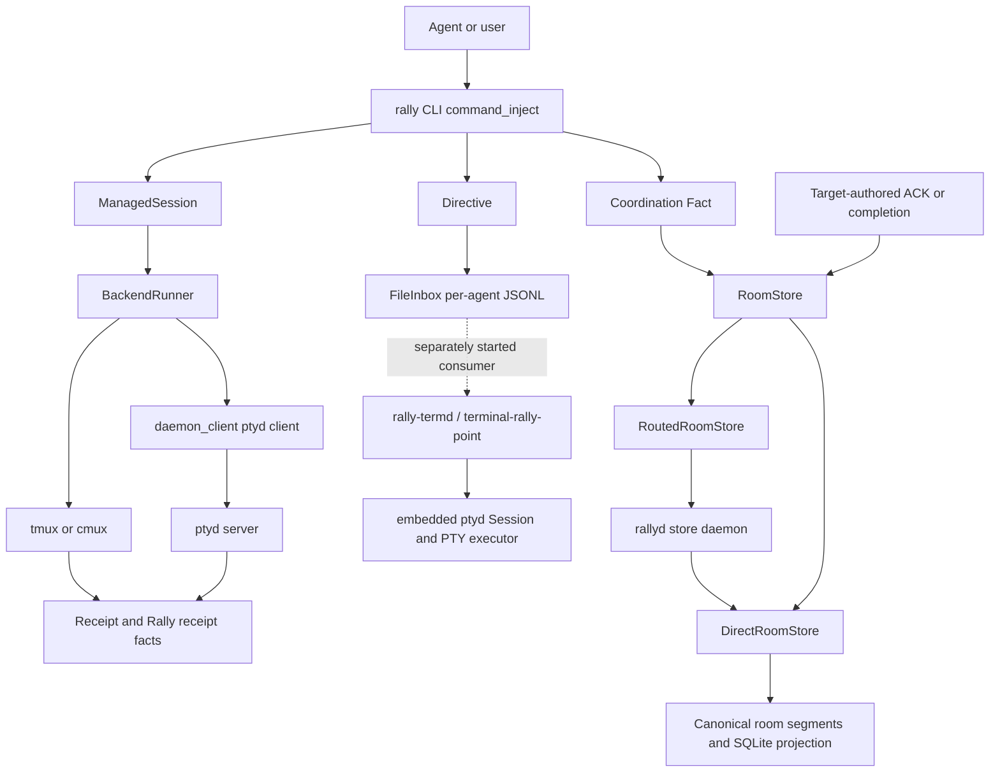
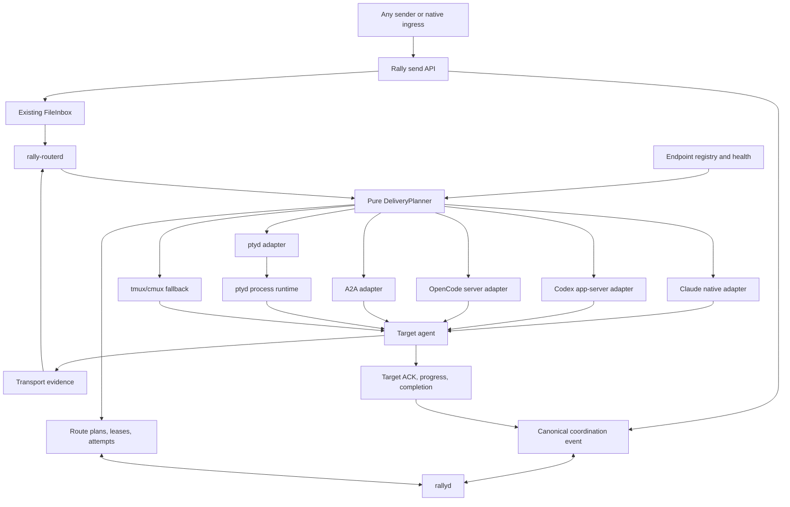

<!-- markdownlint-disable MD013 -->
<!-- SPDX-FileCopyrightText: 2026 Tyrone Ross, Jr <46267523+tyroneross@users.noreply.github.com> -->
<!-- SPDX-License-Identifier: Apache-2.0 -->

# Rally Delivery Router Dependency Map

> **Status (2026-08-10):** R0 shared contracts and the R1 pure planner are implemented in this
> change set; integration, runtime activation, and route cutover remain pending.
> **Rally baseline:** local `main` `8d21f2c`; `origin/main` `3d27f28`. Unrelated working-tree changes
> were excluded from source conclusions.
> **NavGator baseline:** refreshed full scan labeled `8d21f2c`; 621 components, 457 detected
> connections, 176 files, and no scan warnings. Direct Rust references remain authoritative where
> NavGator lacks dependency edges.
> **Companion decision:** [`ROUTER-ARCHITECTURE.md`](ROUTER-ARCHITECTURE.md).
> **Detailed process contracts:**
> [`DAEMON-AND-TRANSPORT-ARCHITECTURE.md`](DAEMON-AND-TRANSPORT-ARCHITECTURE.md).

## Conclusion

The router should be a new, deterministic Rally delivery worker named `rally-routerd`. It should
consume Rally's existing typed `FileInbox`, resolve a Rally identity to one compatible endpoint,
invoke one adapter, and record the route and evidence. It should not schedule work, host terminal
processes, or become another canonical store.

The smallest useful change is smaller than the original clean-sheet proposal:

1. Reuse `Directive`, `Receipt`, `FileInbox`, `ManagedSession`, session identity, and the current
   `ptyd` client.
2. Extract route selection into a pure planner and run it in the sender first.
3. Start `rally-routerd` as the single consumer of the same inbox only after shadow routing agrees.
4. Move `ptyd` delivery behind the router before adding native Claude and Codex adapters.

This sequence delivers the main new capability—delivery that survives sender exit—without first
rewriting the ledger, merging daemons, or building every provider adapter.

## Implementation status

| Slice | Status | What exists now | What remains |
| --- | --- | --- | --- |
| R0 common contract | Implemented and tested in this change set | Flat backward-compatible delivery/receipt envelopes; stable logical dedupe key; unique attempt IDs; endpoint capability descriptors; asserted-versus-verified evidence | No live `FileInbox` format change; no authenticated principal verification |
| R1 pure planner | Implemented and tested in this change set | Deterministic target-first selection, typed rejection reasons, safe fallback rules, provider-neutral policy, and a pure shadow comparator | Convert live session records into endpoint descriptors and call the comparator from `command_inject` |
| R1 live shadow activation | Pending | Existing `BackendRunner` remains authoritative, so current delivery behavior and latency are unchanged | Add one observation-only call at the coordinated `crates/rally-cli/src/lib.rs` send boundary |
| R2+ resident routing | Not started | Contracts make later attempt persistence explicit | Leases, deadlines, durable retry, endpoint probes, worker loop, adapters, and `rally-routerd` |

The current build therefore creates an independently testable policy seam without inserting a
process hop or changing a user's delivery route. It does not yet provide post-sender-exit delivery.

## NavGator findings and limit

NavGator correctly located the relevant components and source positions, including:

- `RoomStore` at `crates/rally-cli/src/store.rs:1200`.
- `ManagedSession` at `crates/rally-cli/src/backends.rs:56`.
- `BackendRunner` at `crates/rally-cli/src/backends.rs:396`.
- `Directive` at `crates/rally-protocol/src/lib.rs:71`.
- `EndpointResolution` at `crates/rally-cli/src/session_identity.rs:109`.
- `Adapter`, `Supervisor`, `ClaudeAdapter`, and `CodexAdapter` in `cockpitd`.

Its impact, connection, trace, and focused-diagram commands returned zero edges for `RoomStore`,
`BackendRunner`, `ManagedSession`, and `Directive`, even though direct source references prove those
call paths. Its coverage report also maps only 99 of 165 files. Therefore:

- NavGator evidence is authoritative for discovered component locations and the measured coverage
  limitation.
- Direct Rust references and Cargo metadata are authoritative for the dependency edges below.
- NavGator's `HIGH` severity with zero affected files is not used as a risk score; that combination
  is internally inconsistent for this repository.
- NavGator's zero-dirty freshness result is not used as worktree evidence; `git status` is the
  authority for local modifications.

## Current architecture



### Current dependency table

| Current component | Depends on | Owns now | Does not own |
| --- | --- | --- | --- |
| `rally` CLI | `rally-cli`, `rally-protocol` | Command parsing, target resolution, ledger-first inject, synchronous route execution, ACK wait | Post-exit delivery |
| `RoomStore` | `DirectRoomStore` or `RoutedRoomStore` | Choice between direct store access and `rallyd` | Agent endpoint or transport selection |
| `rallyd` | `rally-cli::rallyd_core`, `DirectRoomStore` | Per-repo single-writer store, projections, store wire protocol | Processes, network adapters, PTYs, delivery policy |
| `FileInbox` | Filesystem append and per-agent sequence | Durable typed `Directive` and `Receipt` logs | Cross-adapter route choice, attempt lease, endpoint health |
| `ManagedSession` | Session facts | One session, one backend, one target, optional pinned `ptyd` socket/pane | Multiple simultaneous endpoints or capability negotiation |
| `BackendRunner` | `Backend`, external commands, `daemon_client` | Start, attach, capture, stop, liveness, tmux/cmux inject, `ptyd` inject | Durable retry after CLI exit |
| `daemon_client` | `ptyd` JSON-RPC over Unix socket | Rally-owned `ptyd` discovery, start/register/send/read/stop calls | `rallyd`; cross-provider routing |
| `ptyd` server | PTY/process runtime and `agent.send` | Process lifecycle, identity-to-pane map, terminal/structured send evidence | Rally canonical facts and provider-neutral route policy |
| `rally-termd` | `FileInbox`, embedded `ptyd::Session`, PTY delivery executor | Optional external inbox subscriber with high-water marks and receipts | Connection to the separate `ptyd server`, Rally-owned startup, multi-adapter routing, native provider adapters |
| `cockpitd` | Its own SQLite, WebSocket transport, session supervisor, one selected process adapter | App-facing session launch, event stream, approvals, Claude/Codex adapter code | Rally ledger, Rally identity, Rally delivery queue |

### Current call paths

#### 1. Canonical coordination fact

```text
command_inject
  -> inject_content_fact
  -> RoomStore::append_fact
      -> DirectRoomStore
      OR RoutedRoomStore -> .rally/rallyd.sock -> rallyd_core -> DirectRoomStore
  -> .rally/log/<engagement>.jsonl + SQLite projection
```

The `RoomStore::route` name refers only to direct-versus-`rallyd` store access. It is not the
proposed delivery router.

#### 2. Durable delivery directive

```text
command_inject_managed / command_inject_ledger
  -> inject_via_ledger
  -> rally_protocol::ledger::FileInbox::append_directive
  -> .rally/inbox/<agent>.jsonl
```

This path already supplies a durable per-agent queue and monotonic `(to, seq)` dedup key. It writes
outside `RoomStore` and therefore outside `rallyd`'s single-writer store protocol.

#### 3. Immediate delivery

```text
command_inject_managed
  -> ManagedSession.backend
  -> BackendRunner
      -> daemon_client -> ptyd agent.send
      OR tmux/cmux framed injection + capture verification
```

The sending CLI chooses and executes this path. Current `ptyd` delivery can return transport
evidence, but sender-authored transport evidence is not a target ACK.

#### 4. Optional asynchronous delivery

```text
separately launched rally-termd
  -> FileInbox::read_since
  -> RegisteredPolicy authorization
  -> embedded SessionPaneResolver + PtyDeliveryExecutor
  -> Receipt + persisted last_acted_seq
```

The sibling `ptyd` repository implements this path. The installed `rally-termd` accepts explicit
`--ledger`, `--state`, and repeated `--agent` arguments. Its production wiring creates its own
`ptyd::Session`; it does not send to the independently running `ptyd server` socket. Rally does not
currently discover, start, configure, or monitor it. On 2026-08-08, `ptyd server` was running but
`rally-termd` was not. Its execute-then-receipt-then-high-water order also leaves a crash window in
which a PTY action may be repeated; exact-once delivery requires endpoint idempotency that PTY input
cannot generally provide. The R1 planner therefore permits an uncertain-send retry only through the
same endpoint when that endpoint advertises stable-key deduplication. It refuses cross-endpoint
fallback until a later contract can prove that both endpoints share one target-wide dedupe domain.

#### 5. Target ACK and completion

```text
target agent
  -> Rally Resolve / Receipt / progress fact
  -> RoomStore
  -> sender wait_for_resolution or later reader
```

This path is already semantically stronger than provider transport receipts and must remain
separate.

#### 6. `cockpitd` app server

```text
WebSocket client
  -> DirectWs
  -> Supervisor
  -> ClaudeAdapter by default
  -> Claude process stream
  -> cockpitd SQLite events and approvals
```

`CodexAdapter` also exists, but it drives `codex exec`/`resume`, not Codex app-server. Cargo metadata
shows `cockpitd` has no local dependency on `rally-cli` or `rally-protocol`. It is an app/session
server, not a Rally delivery router.

## What is already built

| Required router capability | Existing base | Reuse decision |
| --- | --- | --- |
| Durable recipient queue | `Directive`, `Receipt`, `Inbox`, `FileInbox` | Reuse and extend additively |
| Correlation and idempotency fields | Staged `EventEnvelope` in `rally-cli` | Move/merge into shared protocol; do not duplicate |
| Runtime endpoint derivation | Staged `EndpointResolution` and `ProtocolSessionIdentity` | Integrate and extend with adapter capabilities |
| Managed runtime record | `ManagedSession` | Adapt into endpoint registration; preserve old facts |
| Terminal route implementation | `BackendRunner` | Wrap as terminal adapters, then narrow its role |
| `ptyd` structured send | `daemon_client` and live `ptyd agent.send` | Rename to `ptyd_client`; first dogfood adapter |
| Store daemon | `rallyd` and store wire parity | Keep pure; add only atomic delivery-state operations when needed |
| Inbox subscriber logic | sibling `ptyd::termd` | Reuse watcher, policy, and state tests; replace embedded-session execution and address its crash window |
| Claude stream codec | `cockpitd::adapter::claude` | Reuse parsing lessons only; it is not Claude Channel transport |
| Codex event codec | `cockpitd::adapter::codex` | Reuse parsing lessons only; it is not app-server transport |
| ACK semantics | Rally handoff/resolve wait and receipt distinction | Preserve as the common adapter contract |

## What does not exist

- A Rally-owned resident consumer that resumes pending delivery after the sender exits.
- One endpoint registry that permits several live endpoints per Rally identity.
- A pure planner that compares adapter capabilities and records why it selected or rejected each
  route.
- Durable route attempts, leases, deadlines, fallback order, and restart recovery owned by Rally.
- Claude Channel, Codex app-server, OpenCode server, or A2A delivery adapters in the Rally path.
- A common inbound bridge that records provider-native messages before forwarding them.
- One supervised service surface for `rallyd`, `rally-routerd`, and optional `ptyd`.
- Enforced use of the staged session/principal identity and event-envelope fields on delivery.

## Proposed architecture



### Dependency rules

1. `rally-protocol` owns shared wire types. It depends on no daemon, CLI, or provider SDK.
2. A new `rally-router-core` owns pure route planning and adapter contracts. It depends on
   `rally-protocol`, not on `rallyd`, `ptyd`, or `cockpitd`.
3. A new `rally-routerd` owns the worker loop, endpoint probes, attempt lifecycle, and adapter
   implementations.
4. `rallyd` remains the canonical store server. The router is its client, never its plugin.
5. `ptyd` remains a process/terminal runtime. The router selects it; `ptyd` selects only the
   low-level send method within its endpoint.
6. `cockpitd` remains app-facing. Reusable codecs may later move to a small shared crate, but the
   router must not depend on `cockpitd`'s database, WebSocket server, approvals, or session IDs.
7. Provider-specific payloads stay in adapter-owned opaque extensions; provider vocabulary does
   not enter canonical coordination facts unless Rally gives it provider-neutral meaning.

## Proposed change map

| Surface | Change | Why | First phase | Main regression risk |
| --- | --- | --- | --- | --- |
| `crates/rally-protocol/src/lib.rs` | Add optional event/correlation/idempotency/digest/capability fields or a versioned envelope around `Directive` | Preserve one common message across adapters | R0 | Older `rally-termd` compatibility |
| `crates/rally-protocol/src/ledger.rs` | Add router cursor/claim primitives only if a single-process lock and current high-water marks are insufficient | Crash recovery without a second queue | R2 | Duplicate or skipped directives |
| staged `event_envelope.rs` | Move shared fields to `rally-protocol`; leave compatibility adapter in CLI | Avoid two envelope models | R0 | Old facts missing new fields |
| staged `session_identity.rs` | Activate it and add adapter capability/health registration | Exact target selection | R1 | Wrong endpoint or identity alias |
| `backends.rs::ManagedSession` | Convert legacy session facts into endpoint descriptors | Reuse current sessions during migration | R1 | Old session replay changes |
| `backends.rs::BackendRunner` | Place behind `TerminalAdapter`; stop making it the central route chooser | Keep terminal mechanics while centralizing policy | R1-R4 | Terminal fallback behavior changes |
| `daemon_client.rs` | Rename to `ptyd_client.rs`; implement `PtydAdapter` on top | Remove `rallyd`/`ptyd` ambiguity | R1 | Socket pinning or pane checks regress |
| `lib.rs::command_inject*` | Append first, call planner inline, then later stop direct sends when router health is proven | Safe incremental cutover | R1-R5 | Dual-send duplicates |
| new `rally-router-core` | Add `DeliveryPlanner`, `EndpointDescriptor`, `AdapterCapabilities`, `RoutePlan`, typed rejection reasons | Deterministic, testable policy | R1 | Policy silently prefers wrong route |
| new `rally-routerd` | Consume inbox, hold one per-repo worker lease, execute adapters, record attempts | Delivery survives sender exit | R2-R3 | New background-process failure modes |
| `store_wire` and `rallyd_core` | Add additive atomic operations only for route lease/attempt state that cannot live safely in the inbox side log | Multi-worker safety and observability | R2 | Direct/routed parity drift |
| sibling `rally-termd` | Disable for router-owned rooms or reduce to an explicit legacy mode | Prevent two inbox consumers | R3-R4 | Existing Easy Terminal behavior changes |
| `cockpitd` adapters | No direct dependency; optionally extract provider event codecs later | Avoid app-store/session coupling | Later | Duplicate parsers drift |
| new Claude adapter | Implement verified current native surface behind capability handshake | Fast Claude-to-Claude delivery through Rally | R4 | Preview API drift |
| new Codex adapter | Implement app-server client and schema fixtures | Structured Rally-to-Codex delivery | R4 | Experimental schema/process lifecycle |
| new OpenCode/A2A adapters | Add only after Claude/Codex contract passes | Broaden reach without blocking first paths | R5 | Remote auth and payload preservation |
| CLI service commands | Start/status/stop `rallyd` + router; lazily attach/start `ptyd` | Zero-friction single-user operation | R3 | Process leaks and confusing health |

## Recommended incremental dependency sequence

### Slice 1: pure planner, no daemon change

```text
command_inject
  -> existing ledger writes
  -> DeliveryPlanner in shadow mode
  -> existing BackendRunner remains authoritative
```

Changes: `rally-router-core`, CLI integration, endpoint conversion, table-driven tests.

Capability gained: route policy becomes explicit and explainable. No runtime behavior changes.

### Slice 2: inline planner becomes authoritative

```text
command_inject
  -> existing FileInbox
  -> DeliveryPlanner
  -> PtydAdapter or MuxAdapter
```

Changes: adapter trait, `ptyd_client` rename, terminal adapter wrappers.

Capability gained: one route contract and one ACK vocabulary, still without a new process.

### Slice 3: resident worker consumes the existing inbox

```text
command_inject -> FileInbox -> rally-routerd -> PtydAdapter
```

Changes: worker loop, one per-repo worker lock, cursor/high-water persistence, service health.

Capability gained: delivery continues after sender exit and restarts from pending work. This is the
first user-visible capability current Rally cannot reliably provide by itself.

### Slice 4: native Claude and Codex adapters

```text
rally-routerd -> Claude native
rally-routerd -> Codex app-server
rally-routerd -> ptyd fallback
```

Capability gained: Claude-to-Claude, Claude-to-Codex, Codex-to-Claude, and Codex-to-Codex all use
the same Rally envelope, queue, route evidence, and target ACK semantics.

### Slice 5: OpenCode and A2A

Add these only after the first four paths pass the same adapter contract. A2A also triggers the
remote-auth, payload-classification, and full-envelope transfer requirements.

## Regression blast radius

### Critical

1. **Duplicate delivery during cutover.** Current CLI direct send, `rally-termd`, and the new router
   could all consume the same directive. A room must have one delivery owner, selected by an
   explicit cutover state. Shadow mode may plan but never send.
2. **Directive compatibility.** The sibling `ptyd` consumer shares `rally-protocol`. Additive
   optional fields are safe; required field or enum changes need cross-repository fixtures and a
   compatibility window.
3. **Wrong endpoint selection.** Current `ManagedSession` carries one explicit target. A registry
   introduces choice. Exact session identity, pinned endpoints, expiry, capability checks, and
   ambiguity refusal must precede preference scoring.
4. **False ACK.** Provider send success, PTY bytes written, target read, and task completion remain
   separate evidence states. An adapter cannot promote its own transport receipt to target ACK.
5. **Store split-brain.** Delivery directives currently bypass `RoomStore`. Adding route state to
   both `FileInbox` and canonical facts without one correlation key would create two truths.

### High

1. **`rallyd` privilege expansion.** Putting adapters inside `rallyd` would add process/network
   authority to the canonical store and violate its current enforced charter.
2. **Easy Terminal regression.** `terminal-rally-point` is an Easy Terminal binary. Disabling its
   inbox consumption globally would break users outside router-owned rooms.
3. **App-server state leakage.** Reusing `cockpitd` directly would mix its account/session store,
   approvals, and UUIDs with repo-scoped Rally identity.
4. **Provider schema drift.** Claude native surfaces and Codex app-server require versioned
   capability probes, captured fixtures, and an automatic fallback path.
5. **Background-process burden.** Separate processes are internally correct but must appear as one
    service with one doctor/status surface and no required setup for a single user.

### Medium

1. **Naming collision.** `RoomStore::route` already means direct-versus-daemon store access.
    Delivery code must use `DeliveryRouter`, not an unqualified `Router`.
2. **Performance.** A durable worker hop may increase low-percentile latency. Local Unix sockets,
    inline drain during migration, and p50/p95 measurement control this risk.
3. **Lossy codecs.** A provider adapter that cannot preserve a required field must reject the
    route. Opaque extensions preserve fields Rally does not interpret.
4. **Direct native bypass.** Claude-to-Claude or Codex-to-Codex messages sent outside Rally cannot
    be guaranteed in the ledger unless the provider exposes a verified interception hook.

## Verification map

| Invariant | Existing evidence to retain | New evidence required |
| --- | --- | --- |
| Ledger write precedes transport | `daemon_inject_routing`, `channel_roundtrip` | Adapter contract test for every route |
| Direct and `rallyd` writes match | `write_authority_daemon_parity` | New delivery-state store operations in parity suite |
| No hidden `ptyd` crate dependency | `arch_no_herdr_dep` and mirrored wire contract | Router adapter boundary test |
| Directive wire remains compatible | `rally-protocol` contract roundtrip and ledger security | Old-reader/new-writer and new-reader/old-writer fixtures with sibling `ptyd` |
| Sender cannot fake target ACK | Existing inject ACK tests | State-machine mutation test per adapter |
| One directive produces one delivery | None across all current consumers | CLI/router/`rally-termd` cutover race test |
| Restart does not lose work | `FileInbox` durability and `rally-termd` high-water design | Kill at every router transition, restart, assert one attempt outcome |
| Exact endpoint wins | `session_identity` unit tests, `ptyd` pane echo check | Multi-endpoint ambiguity and stale-registration tests |
| Provider combinations work | Terminal route integration tests | Claude→Claude, Claude→Codex, Codex→Claude, Codex→Codex |
| Offline remains correct | Ledger-only inject path | Router absent, receiver pull still observes the canonical event |

After each code slice, run a new NavGator full scan and `navgator arch-diff` against `8625be8`.
Treat new dependencies from `rallyd` to provider, network, process, `ptyd`, or `cockpitd` code as a
blocking architecture regression.

## Challenges to the original proposal

1. **Do not build another inbox.** Rally already has `FileInbox`; the missing product capability is
   an owned consumer and route policy.
2. **Do not describe post-exit delivery as wholly absent.** The external `rally-termd` mechanism
   exists, but Rally neither deploys nor generalizes it. The gap is ownership and multi-adapter
   routing.
3. **Do not reuse `cockpitd` as the router.** It solves app session supervision with a separate
   store. Reuse codec lessons, not its control plane.
4. **Do not add native adapters first.** Centralizing policy before the worker makes adapter behavior
   comparable; starting with `ptyd` dogfoods the router using an already-tested transport.
5. **Do not require three user-managed daemons.** Keep the internal boundaries, but expose one Rally
   service lifecycle and start `ptyd` only when selected.
