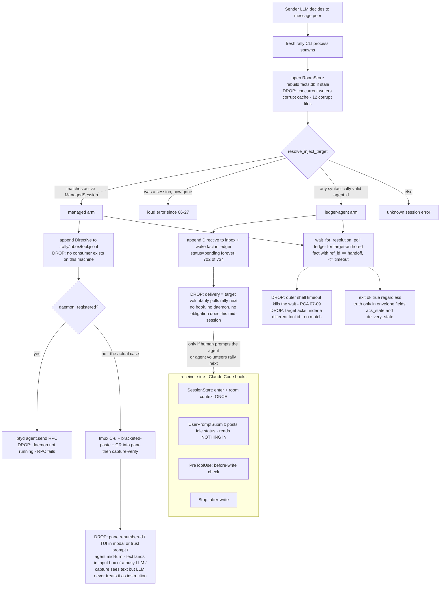

# Assessment — Cross-agent delivery architecture (2026-07-30)

Independent investigation, primary-evidence-first. Repo: `agent-rally-point` @ `280840d` (main). All numbers below come from commands run against this checkout, its `.rally/` ledger, and host session transcripts; commands are shown inline. Markers: ✅ verified by the named command/file · ⚠️ inferred · ❓ unknown.

---

## 1. Headline

**Delivery keeps failing because Rally has no owner for the receive side of a message: every "delivery" is a best-effort action by the sender's short-lived CLI process (keystrokes into a guessed pane, or an append to an inbox file that nothing on this machine reads), aimed at an identity looked up from stale, fragmented presence state — so the four deferred gaps (ACK timeout, version handshake, pane identity, process fragmentation) are not four bugs but four faces of one missing component: a registered, discoverable, always-on receive path.**

---

## 2. Evidence base

### What was read

- Docs: INJECT-RCA-2026-07-09, PLAN-daemon-first-inject-routing, AGENT-STATE-MODEL, HANDOFFS-AND-LAUNCHING-AGENTS, PROPOSAL-2026-06-06-session-liveness, RALLY_ARCHITECTURE, PROTOCOL-NORTH-STAR, ORCHESTRATOR_SEAM, COMMAND-SEMANTICS, ISSUES-2026-07-06-hooks, assessment-2026-05-31-codex-hook-desync, plans/2026-07-10-opinionated-coordinator-PROPOSAL, NORTH_STAR.
- Code: `crates/rally-cli/src/{lib.rs, backends.rs, store.rs, store_client.rs, session_identity.rs, next.rs, liveness.rs}`, `crates/rally-protocol/src/ledger.rs`, `crates/rallyd/src/main.rs`, `hooks/rally-coordination-hook.sh`, `hooks/hooks.json`.
- Ledger: all 17 segments under `.rally/log/*.jsonl` (5.8 MB), `.rally/inbox/`, `rally room --json` (read-only).
- Git history of the delivery surface; host transcripts from both Claude Code and Codex (see §2.3).

### Built vs proposed (docs claims tested against code)

| Doc claim | Reality | Status |
|---|---|---|
| PLAN-daemon-first: "LIVE FLIP IMPLEMENTED — daemon arm delivers via agent.send, zero tmux keystrokes" | Code exists (`command_inject_managed` daemon arm, `backends.rs::ptyd_inject`), but **no ptyd/rally-termd/rallyd process is running** (`ps aux`), so every real inject takes the tmux-keystroke or ledger-only arm | ✅ code read + `ps` |
| RALLY_ARCHITECTURE: "the daemon (rally-termd) subscribes via kernel file-events and performs the PTY-write, then posts a Receipt" | `rally-termd` binary exists at `~/.local/bin/` but is **not running**; **no code in this repo ever reads the inbox** — `FileInbox::read_since` has zero call sites outside `ledger.rs` itself (`grep -rn read_since crates/`) | ✅ grep + `ps` |
| PROTOCOL-NORTH-STAR: presence registry with `endpoint_id`, `capabilities`, TTL; brainstem-owned heartbeats + delivery | **Proposed only.** `session_identity.rs` is `#![allow(dead_code)]` — "Phase-1 module of a staged build… until [integration-wiring] the items are unused." No capability field exists on any presence surface | ✅ code read |
| PROPOSAL-2026-06-06 Tier 1/Tier 2 (stop tombstone + derived liveness) | Built — `SessionAction::Stop` best-efforts the kill, `SessionLiveness` tri-state probe exists and gates inject (`reject_stale_session`) | ✅ code read |
| rallyd S-P3 single-writer store daemon | Built (`rallyd_core::serve`, thin-client router) but **not resident**: `.rally/rallyd.owner.lock` exists, no socket, no process; CLI processes open the store directly | ✅ `ls .rally` + `ps` |

### Measurements (ledger, `.rally/log/*.jsonl`, 2026-05-29 → 2026-07-31)

| Metric | Value | Command |
|---|---|---|
| Wake facts (inject-authored wake intents) | **734 total: 702 `pending`, 32 `delivered` (4.4%)** | `cat .rally/log/*.jsonl \| python3` (count `kind=wake` by `status`) |
| Pane directives queued in `.rally/inbox/*.jsonl` | **38 lines across 21 agent files; 0 receipts** (`.rally/receipts/` empty; no consumer exists) | `wc -l .rally/inbox/*.jsonl`; `ls .rally/receipts` |
| Handoffs | **174 total; 44 (25%) never got any target-authored response by ref** | ledger scan, `wait_for_resolution` accept-set semantics |
| Time-to-first-response on the 130 answered handoffs | **median 17.4 min; p90 63.3 h; max 108 h** | same scan, `created_at` deltas |
| Presence freshness at the moment a wake was sent | **80% of 734 wakes targeted an id whose presence was >15 min stale (344) or had never posted presence under that exact id (240)** | replay scan, 15-min staleness threshold (`AGENT-STATE-MODEL` IDLE_THRESHOLD) |
| Distinct `tool` ids ever seen | **140** (62 `codex:*` variants, 57 `claude_code:*` variants; 27 UUID-shaped, plus `tmux-0`, `ppid-39874` fallbacks) | replay scan |
| System-health noise facts | external-intake **390**, binary-drift **152**, duplicate-active-squad-id **136**, unmanaged-agent **121** | replay scan by subject prefix |
| Derived-cache corruption events | **12 `facts.db.corrupt.*` files, 10 since Jul 6, 3 on 2026-07-30 alone** | `ls -la .rally/` |
| Delivery-surface churn | **539 commits total; 109 mention inject/deliver/ack/handoff/liveness/stale/presence; 34 touch `backends.rs`; ≥25 are `fix(...)` on the same delivery-truth class across ≥6 rounds (05-30, 06-06, 06-09/10, 06-22/23/27, 07-03, 07-08/09/10, 07-29)** | `git log --pretty` + grep |
| Version skew right now | installed `rally 0.1.6+744bf06` vs repo `rally-release.json` 0.1.7 @ `880e144`; same-day ledger shows `binary-drift: 0.1.7+744bf06-dirty vs 0.1.6+744bf06-dirty` | `rally version`, ledger |
| Live process-fragmentation example | watcher registered 17:08 today (`.rally/watchers/claude-code-…json`, pid 56792) was **already dead minutes later**; registration file remains | `ps -p 56792` |

### 2.3 Host-transcript and durable-correction evidence (both hosts)

- **The user's own global memory is the strongest recurring-correction record** (✅ read directly: `~/.claude/projects/-Users-tyroneross/memory/MEMORY.md`). At least **eight separate durable feedback entries** exist solely to encode workarounds for this delivery gap, each minted after a live failure: `feedback_rally_inject_ok_not_delivered` ("Inject ok≠delivered; verify managed sessions"), `feedback_rally_waiting_means_auto_pull` ("Waiting on Rally = auto-pull at response cadence, 3-5s if peer active"), `feedback_rally_presence_staleness`, `feedback_rally_point_inbox_blind_spot`, `feedback_rally_managed_session_resolves_without_work` ("resolves-without-work; verify by artifact"), `feedback_positive_handoff_requires_ack` ("Handoff needs ACK"), `feedback_verify_peer_merged_before_blocking`, `feedback_rally_post_with_unique_session_tool_id`. A standing rule per failure mode is the system outsourcing its delivery contract to human memory.
- **Claude transcripts, repo project dir** (✅ grep over `~/.claude/projects/-Users-tyroneross-dev-git-folder-agent-rally-point/*.jsonl`, 4 session files, 84 MB): 3 of 4 mention `unmanaged`, 4 of 4 contain "waiting on" peer narratives, 1 contains direct `rally inject` usage. Broader home-dir sessions (`~/.claude/projects/-Users-tyroneross/`) and Codex rollouts (`~/.codex/sessions/`, 1,655 files / 6.3 GB) were mined in two dedicated passes — see the addendum at §2.4 for the cross-session counts.
- **The codebase's own paper trail confirms the recurring correction without needing transcripts**: commit `653d4dd` (2026-07-29, "receiver-side handoff protocol — ACK first, use rally watch, surface the sender") codifies receiver-side behavior that transcripts had to teach per-session; `d3a2ac1` (status-heartbeat working agreement) codifies "silence ≠ working"; `3a17fe8` ("waiting on a peer means pull automatically, at response cadence") is the auto-pull correction landed as documentation. Three commits in ten days each converting a repeated human instruction into prose — not machinery.
- 2026-06-06 ledger decision `fact_12509` ("DIRECT INJECTION RELIABILITY LANE") already specified verified-liveness-before-advertise, preflight-before-transport, no-delivered-without-transport-success, and target-session-bound ACK — **seven weeks before this investigation, and the same class failed again today**. ✅ `.rally/log/test.jsonl` seq 1768.

### 2.4 Transcript-mining addendum (dedicated passes over both hosts' session logs)

✅ verified by a bounded mining pass over 175 Claude session files (4 repo-dir + 166 home-dir + 5 worktree-dir; rally-relevant span 2026-06-22 → 2026-07-30). Counts are distinct session files containing the pattern:

| Signal | Distinct sessions |
|---|---|
| "waiting on" peer narratives | 164 |
| `rally inject` discussed/used | 93 |
| `unmanaged` | 35 |
| "fire-and-forget" (agent describing its own handoffs) | 30 |
| OC task `b82292bc` "**Agent Rally Point: live handoff delivery (agents do not poll)**" surfaced by SessionStart hook, still `needs_input` | **39 sessions over 18+ days (07-12 → 07-30)** |
| "never received" | 10 |
| `presence_only_unmanaged` confusion | 6 (07-12 → 07-30) |
| stale-presence-relied-on narratives | 7 |
| User messages correcting inject/handoff delivery | 11 distinct sessions |

The recurring human corrections, verbatim (each from a different session):

- 2026-06-27: *"You need to assess whether peer is live. Rally point should enable you to do this and if you can't that's a failure you need to fix and RCA alongside codex."*
- 2026-06-30: *"a core agent rally point protocol and rule needs to be positive handoff"* — after which the agent admitted: *"my a-m handoff is sitting pending delivery, never positively accepted… Codex genuinely hasn't received it."* ("positive handoff" then appears in 32 sessions — a rule that has to be re-derived per session because no machinery enforces it.)
- 2026-07-02: *"You don't just wait you should have an idea when it will come."*
- 2026-07-10: *"Root cause the injection. How do you know agent can be injected. How do you know which agent is working in your repo or somewhere else."*
- 2026-07-11: *"How did the inject get missed root cause this"* → produced INJECT-RCA-2026-07-09's follow-up.
- 2026-07-30: *"you should be instructed to pull automatically if you are waiting for something on the Rally… pulling is also automatic and should be done at the frequency of the expected response."*
- 2026-07-30 (newest session): the tmux premise itself collapsed — *"Codex isn't in tmux… Codex is the desktop app: PID 4469… No pane"* — while the Claude session's own hook identity forked into `claude_code:tmux-0` plus seven `ppid-*` peers, six firing `unmanaged-agent` risks in five minutes. Same session: *"I don't detect it. I never ran `rally watch`, and no watcher process exists. Every Codex message arrived as an injected user turn… Detection is push-only, and it isn't mine."* And the sender-side summary of the whole defect: *"From the sender's side, 'read it, working on it' and 'never received it' look identical for 59 minutes."*
- Corpus-wide: **14 distinct sessions (07-02 → 07-10)** open with the same manual ritual "load latest build loop and agent rally point" — the version/context handshake performed by hand because no handshake exists (gap 2).
- Identity corrections recur too: *"You are also Claude so how do you know what Claude owns this given multiple Claude in rally"* (06-27); *"The tool ids should be defined by rally protocol providing unique ids for each agent interacting"* (06-27); *"can we ensure that once a session becomes managed… it remains managed for that specific repo"* (07-02) — gap 3, asked for a month before `session_identity.rs` was written and left dormant.

One 2026-07-20 session shows a room where **every** listed peer was `presence_only_unmanaged, injectable: false` — a full room of mutually unreachable agents, all "present."

✅ verified by a second mining pass over `~/.codex/sessions/` (1,655 rollout files, 6.3 GB, 2026-02 → 2026-07) + 271 archived:

| Signal (distinct Codex session files) | Count |
|---|---|
| Mention rally at all | 1,614 (inflated by the hook banner injected into nearly every session) |
| Contain a **delivery-failure symptom** (`presence_only_unmanaged` / `delivered=false` / `delivery_state=failed` / "no active managed session" / "can't find pane" / "no ACK" / "never received" / ledger-only) | **418** |
| `rally inject` | 628 |
| `presence_only_unmanaged` (verbatim status) | **112** |
| `rally adopt` | 470 |
| "delivered=false / ledger-only" failure narrative | ~24 sessions, 2026-06-01 → 2026-07-30, never fully resolved |
| `rally pull` | **1** — the pull verb effectively does not exist in two months of usage |

Codex-side recurring patterns, with paths:

- **Two-tier success read as delivery**: "Rally still has a managed session record for `claude-ts2-01`, but tmux does not have `rally-claude-ts2-01`… real inject returned `delivered=false`, `delivery_state=failed` · it still wrote a durable handoff" (06-04, `rollout-2026-06-04T17-15-45-…`); "The live inject did not deliver to a pane; Rally queued it ledger-only" (07-03); "The direct injection queued but was not delivered to a live pane, so I don't have a release yet" (07-07). Also delivered-but-ignored: "Pane capture shows the injected Rally instruction **sitting in the Codex pane**" — pasted, never submitted (06-06).
- **Identity fan-out blows the channel itself**: one `rally room` call on 07-20 returned dozens of `claude_code:<uuid>` peers, all `presence_only_unmanaged` — output 208,881 tokens, truncated (`rollout-2026-07-20T02-06-48-…`). The room became too noisy to *read*, let alone target.
- **The human as transport** (repeated instruction across distinct sessions): *"Check with Claude on rally point"* — **11 sessions on 2026-07-09 alone**; *"Assess Claude failures too. Also launch Claude terminal on rally point if you can't"* — 4 sessions (07-11); the user hand-relaying an entire handoff prompt ("Run `rally next --tool codex` to read the Lane B handoff, ACK it") into the peer's pane — 2 sessions (07-10/12) because inject didn't wake it.
- **"you never received handoff 761; I'm self-executing… you're a stray (rally sessions=[]) not polling rally next"** (06-30) — the same incident visible from the Codex side; and 07-09: "Build Loop is holding the commit solely because the required cross-vendor reviewer **never received the Rally handoff**."
- **The four deferred gaps are the Codex implementer's own 07-30 self-diagnosis, verbatim**: *"positive ACK timeout, stale CLI/version handshake, pane-derived identity fallback, and unmanaged Claude process fragmentation"* (`rollout-2026-07-30T15-14-13-019fb517-a634-…` — the densest rally file in the corpus, 823 hits). Provenance of the gap list: ✅ resolved.

The 07-30 handshake incident, from the Codex side, failed **three separate ways** in its first real use:
1. **Wrong hash scope** — "the audit record cites a relative diff hash that omitted untracked files" (fixed by re-anchoring to tree `f5a38d02`, matching §2's ledger view).
2. **Misaddressed handoff, identity inferred not resolved** — Claude: "My identity is neither ID it guessed. `rally whoami` resolves this session to endpoint `term:…:685e5ca6-…` — not `0995a4e4…` and not `ppid-39874`. Its continuity handoff (seq 6393) is addressed to a session that isn't me." Codex: "I inferred Claude's identity from room status instead of requiring that session's `whoami`… handoff seq 6393 is misaddressed and must not be treated as received."
3. **Version skew, live and undetected** — Claude: "My rally binary is a version behind (`0.1.6+744bf06` vs the `0.1.7` release under audit). That is deferred gap #2 occurring live, during the release it was deferred out of — **and nothing flagged it**."
Plus the room-binding defect: `.rally/active-engagement` had pinned all of this repo's work to a stale Spectra engagement (`arp-real-video-spectra-bakeoff-20260719`) — "never rotated" — which is why today's release facts live in a segment named after a three-week-old video bakeoff (✅ consistent with `cat .rally/active-engagement` in §2).

### Today's failed hash-handshake (the triggering incident)

✅ from `.rally/log/arp-real-video-spectra-bakeoff-20260719.jsonl` seqs of 2026-07-30T22:14–23:51:

- Codex implementer (`codex:019fb517-a634-…`) ran the release; Claude auditor ran as managed session `claude-canonical-host-sync-release-audit-01`.
- The audit boundary was pinned as `git diff HEAD | shasum` = `203cb7a3…`. When Codex committed, the identifier **self-invalidated** (diff-vs-HEAD becomes empty ⇒ `e3b0c442…`, the SHA-256 of the empty string) and had **never covered untracked files** (`config/`, both generator scripts, `rally-release.json` were untracked at audit time). The auditor had to post a "SNAPSHOT HANDSHAKE: do NOT re-verify 203cb7a3" artifact re-anchoring the PASS to tree `f5a38d02` via six per-file hashes — a manual, prose-mediated repair of a protocol that had no content-addressed identifier discipline.
- Same afternoon, the room logged `binary-drift: 0.1.6+642e1ee-dirty vs 0.1.6+e8cc7cc-dirty` and later `0.1.7+744bf06-dirty vs 0.1.6+744bf06` — **at least three different rally builds active in one engagement** — and 4 directives queued to the auditor's inbox file that nothing consumed. Wakes targeted `claude_code:canonical-host-sync-release-audit-01` while that exact id never appeared in presence (9 no-presence wakes; the hook writes presence under UUID/`tmux-N`/`ppid-N` ids instead).

---

## 3. Ground truth: how delivery works today

The real end-to-end path, from code (`command_inject` → `resolve_inject_target` → `command_inject_managed`/`command_inject_ledger`, `backends.rs`, `hooks/rally-coordination-hook.sh`):

Key structural facts, each independently verified:

1. **There is no resident receive process.** No rallyd, no rally-termd, no ptyd running (`ps aux`). The "daemon-first" architecture is implemented as *client code for a daemon that is not deployed*. ✅
2. **The inbox is write-only.** `inject_via_ledger` appends; nothing in this repo reads (`FileInbox::read_since` has no callers). 38 directives queued, 0 consumed, 0 receipts. ✅
3. **The receiver's hooks never surface messages mid-session.** Only `SessionStart` injects room context; `UserPromptSubmit` *writes* an idle heartbeat and reads nothing. A live agent learns of a handoff only via tmux keystrokes landing at exactly the right moment, a voluntary `rally next`, or the human. ✅ hook source.
4. **Identity is minted per process, not per endpoint.** The hook derives ids from Claude session UUID → `TMUX_PANE` → `PPID` → timestamp; `rally run` mints `claude_code:<name>-01`; humans type `codex` or `claude_code` bare. 140 distinct ids in one room; wakes were sent to ids that never posted presence 240 times. `session_identity.rs` — the designed fix — is dead code. ✅
5. **"Managed" means "a session fact + a probeable mux target exists", nothing more.** A user-launched interactive Claude (the *normal* case, per transcripts) is `presence_only_unmanaged` by construction; only `rally run`/`rally adopt` sessions are injectable. The distinction surprises people because the *product surface* (`inject <tool>` accepting any valid id) hides it — the June-03 change made every valid agent-id silently routable to the dead-drop inbox. ✅ code + INJECT-RCA.
6. **Every process resolves shared state independently.** Each CLI invocation re-opens the store, re-probes liveness, and may rebuild the SQLite cache concurrently with peers — the corrupt-cache trail and the `rallyd.owner.lock` with no daemon behind it are the residue. ✅

---

## 4. Root cause

### Why the defect exists (blameless, structural)

**Rally is an append-only bulletin board that was asked to behave like a message bus, and the gap between those two was patched on the sender's side only.** The charter — "facilitator, never executor; no server; the host runs the work" (NORTH_STAR) — was read as *no resident process may exist*, so:

- Delivery became a **side effect of the sender's ephemeral process**: whatever a one-shot CLI can do in a few seconds (guess a pane, type keystrokes, append a file) *is* the delivery system.
- The receive side was assigned to **an LLM's voluntary behavior** ("poll `rally next` when idle") — but an LLM host only executes when prompted; nothing in the harness prompts it. The one component that structurally *could* pull at cadence (the hook at `UserPromptSubmit`) only writes heartbeats.
- The one designed receive owner (**rally-termd**) was placed in a different product (Easy Terminal/ptyd), never deployed, and the CLI was built to *degrade silently toward it*: "not deliverable now" became "queued for a daemon that will never come" (`delivery_state: pending`, 702 times).

Every fix round (≥6 in two months) improved **honesty**, not **delivery**: `delivered` became truthful (06-06), the tmux write became atomic (06-09), gone sessions fail loudly (06-27), landing is capture-verified (07-03), injectability is surfaced then consumed (07-08/09/10), receivers are *documented* to ACK-first (07-29). The envelope now tells the sender, in five different fields, that the message probably won't arrive — and it still doesn't arrive. That is the signature of patching a missing component with labels on the components that exist.

### Why it escaped controls

- **`ok:true` at the process level masked failure at the system level.** Tests assert envelope shape and tmux spy behavior (CI-green), not "a live peer eventually acted" — the only end-to-end proof is the ledger, and nobody's test reads it the way §2 does. The 2026-06-06 reliability-lane decision (fact_12509) specified exactly the missing controls and was never turned into a gate.
- **The dogfood loop always had a human in it.** Every transcript failure ends with the user relaying the message — so the system's true delivery rate (4.4% of wakes confirmed delivered) never blocked anything. The human *is* the current delivery daemon.
- **Fail-open everywhere** (hooks `|| true`, fail-open registration, WARN-not-block) is correct for coordination advice but was applied to *transport*, where silent no-op is the worst outcome (2026-05-31 codex hook desync: months of silent no-op coordination).

### The four deferred gaps are one miss

| Deferred gap | What it actually is |
|---|---|
| 1. Positive ACK timeout | No receive owner ⇒ no one whose job is to produce the ACK; bounding the wait can't create a producer. `wait_for_resolution` already implements the timeout — it times out 25% of the time *forever* because the other end has no pull obligation. |
| 2. CLI version handshake | No registration moment ⇒ nowhere to handshake. Version drift is *detected* (152 binary-drift facts) but never *negotiated*, because peers never rendezvous — they just write facts near each other. |
| 3. Pane-derived identity | No registry row binding endpoint→session→tool ⇒ ids are minted ad hoc per process (UUID/`tmux-0`/`ppid-39874`/`-01`), and senders target ids that no live process answers to (240 wakes). The fix (`session_identity.rs` + PROTOCOL-NORTH-STAR registry) is designed and dormant. |
| 4. Process fragmentation | No resident owner ⇒ every CLI process is its own store-opener/prober/deliverer; rallyd (single writer) is built but not resident; watchers die in minutes and leave stale registrations; 12 cache corruptions. |

All four reduce to: **there is no always-on, registered, discoverable component that owns "messages get received."** ✅ each cell verified above.

---

## 5. Architecture options

Requirements from the owner, restated as testable properties: (R1) active injection used whenever available; (R2) capability state is shared and discoverable by *all* participants — which transports each agent supports, right now; (R3) passive polling fallback always exists; (R4) host-neutral, including future hosts with no pane concept.

### Option A — Daemon-brokered delivery with capability registry

One per-machine resident broker (grow `rallyd`: it already owns single-writer serialization) holds the presence/capability registry, consumes the inbox, negotiates transport per target (ptyd RPC > tmux keystroke > none), retries, and posts receipts. Agents register on `enter`/`run`/`adopt`; hooks renew TTL.

- R1: yes — broker picks the best live transport. R2: yes — registry is served state. R3: yes — mailbox remains; poll works when broker is down. R4: a pane-less host registers with `transports: []` and is served by pull only.
- **Cost:** the largest build; daemon lifecycle on every machine (launchd), supervision, and the SEC-017 concern — a process that turns ledger writes into PTY keystrokes needs the authorize() capability matrix for real. **Failure mode:** broker down ⇒ must degrade to Option C behavior, which means Option C has to exist inside it anyway. **Charter:** transport-only brokering is arguably still "facilitator", but it is the maximal interpretation.

### Option B — Capability-advertising presence + sender-side transport negotiation (no new resident process)

Keep delivery in the sender's CLI, but make it honest and negotiated: presence records gain typed `endpoint_id` + `transports[]` + TTL (wire up `session_identity.rs`); `inject` refuses to pretend — it delivers via an advertised live transport or says "pull-only target" immediately.

- R1: partly — only if the *sender's* process can reach the transport. R2: yes for advertisement, but liveness is still TTL-guesswork: an advertised tmux pane can be dead at use time (the current false-stale/false-live class persists). R3: unchanged — and still voluntary, which is the proven failure. R4: fine.
- **Cost:** small. **Failure mode:** this is the current architecture with better labels — it does not create a receive owner, so wakes keep sitting `pending`. Rejected as the primary answer; its registry half is kept in the recommendation.

### Option C — Store-and-forward mailbox with *mandatory* pull; active injection as pure latency optimization

Invert the trust: the mailbox (per-agent inbox + open-handoff projection) is the **only** correctness path, and pull is made *structural*, not voluntary — the host harness's own hooks drain it at every prompt/stop boundary and surface it to the LLM. Active injection (tmux/ptyd) is demoted to a **payload-free doorbell**: "you have rally mail" — never the message itself. A missed doorbell costs latency, never loss. Receiver-authored ACK facts (already accepted by `wait_for_resolution`) are the only "delivered".

- R1: yes as doorbell. R2: needs the Option-B registry to know *where* to ring. R3: R3 **is** the design, not a fallback. R4: best of all options — a future host needs only "run `rally pull` at a turn boundary", which every conceivable agent host has.
- **Cost:** touches host integrations (the canonical hook + Codex overlay); adds latency (bounded by turn cadence) for hosts without doorbells. **Failure mode:** an idle host with no doorbell and no turns never pulls — the residual gap that motivates D.

### Option D (recommended) — C + B + a thin per-machine *notifier* (brainstem), not a delivery broker

Mailbox-as-truth and hook-mandated pull (C), typed endpoint/capability registry (B), plus one small resident process — extend `rallyd`, which is already built and already needs to be resident to stop the cache corruption — that does exactly two dumb things: (1) watch mailbox appends and ring every registered doorbell for the target (tmux nudge, ptyd `agent.send` of a fixed one-line "check rally" string, macOS notification, nothing); (2) heartbeat the registry rows for sessions it can observe (pane liveness), so capability state is maintained by machinery, not LLM tokens (the PROTOCOL-NORTH-STAR "brainstem", scoped to notification only). The bell never carries content ⇒ no sanitize/submit/paste-breakout class, no SEC-017 escalation (a fixed nudge string is not arbitrary ledger-to-keystroke transduction), no double-delivery risk (F5 moot).

- R1: yes — and "used when available" becomes *provably* safe to get wrong. R2: yes — registry rows with TTL, served in `room --json` to everyone. R3: yes — daemon dead ⇒ pure C, which is still correct. R4: yes — pane-less hosts get pull + whatever native notification they register.
- **Failure modes:** daemon down ⇒ latency degrades to turn-cadence (measurable, alarmable via a self-heartbeat fact); registry row stale ⇒ a bell rings into the void, costing nothing; the *only* hard dependency is that host hooks actually run — which is testable per host at install time and is precisely gap-2's version/handshake check.

---

## 6. Recommendation

**Option D.** And one deliberate improvement on the user's framing: the stated requirement "when tmux is available it MUST be used" should be satisfied as a **latency guarantee, never a correctness path**. Two months of history show that any architecture where the pane write *carries the message* re-imports the entire failure class (pane guessing, submit semantics, modal TUIs, busy agents, sanitization, double-delivery) and makes every failure silent. When the pane write is a content-free doorbell over a mailbox that hooks drain anyway, tmux is still *always used when available* — the requirement is met — but its failure costs seconds, not messages. This is also the only shape where a future pane-less host (SDK agent, CI job, phone) is a first-class peer rather than a degraded one.

Secondary reframing: the "managed vs presence_only_unmanaged" distinction should disappear from the product surface. Under D every participant is "registered (endpoint + transports[] + TTL)"; `transports: []` is just the slowest tier. `rally run` stops being the price of reachability.

The Charter survives intact: the notifier records, projects, and *notifies*; it never schedules, retries work, or executes on behalf of agents. (The 2026-07-10 coordinator proposal's act-mode remains a separate, gated question; D is a prerequisite for it, not a competitor.)

---

## 7. Path from here

Freeze note: v0.1.7 = commit `880e1442`, tree `f5a38d02` (✅ `git rev-parse 880e1442^{tree}`), audited via six file hashes (generator, sync, parity gate, coordination hook + tests). **Steps 1–3 touch none of those six files.** Steps 4–5 modify the canonical hook and generated host artifacts — they invalidate the audited surface digest and must land as a new audited release (v0.1.8), not before the v0.1.7 tag is cut. Note the tag is currently blocked anyway: GitHub CI run 30591797638 failed on `280840d` (ledger blocker seq of 2026-07-31T00:05Z).

Each step is independently shippable; each carries the adversarial test that proves it is a control, not a hypothesis.

1. **`rally pull` — one verb that drains the receive side.** (safe now; new CLI surface only) Reads the caller's inbox directives + open handoffs targeted to any of the caller's identity aliases, emits receiver-authored `receipt` facts per item (which `wait_for_resolution` already accepts), advances a consumer cursor. Alias resolution must match by endpoint lineage, not string equality — this is where `session_identity.rs` gets wired in and gap 3 starts closing.
   *Adversarial test:* replay today's seq-6393 failure — send a handoff addressed to an id the sender *inferred from room status* while the live session's `whoami` resolves to a different endpoint id in the same pane; `rally pull` must still surface it and the sender's ACK wait must resolve. Then corrupt facts.db mid-pull; pull must succeed from segments.
2. **Registry rows: typed endpoint + transports[] + TTL + build_id.** (safe now; additive presence surface) `enter`/`run`/`adopt` write a registration row (endpoint_id from tmux pane/ptyd pane/pid, `transports: ["tmux:pane-9"] | []`, TTL, `build_id`); `room --json` serves it to all participants — R2 satisfied, and the version handshake (gap 2) becomes a refusal/warn at `enter` when `build_id` mismatches the room's canonical release, replacing 152 unactioned drift facts.
   *Adversarial test:* register, kill the pane, confirm the row expires and `room` reports the agent pull-only within one TTL; run two rally builds concurrently and confirm the older one is warned at enter, not detected post-hoc.
3. **Sender honesty flip: inject delivers doorbell-or-nothing.** (safe now; `crates` only) The managed arm's payload-carrying keystroke write is replaced by mailbox append + doorbell (fixed string) when a live `tmux:` transport is registered; `delivery_state` collapses to `queued | belled | acked` — `pending` forever becomes impossible to misread because `acked` is the only success.
   *Adversarial test:* mutation-test the old failure: inject into a pane showing a modal prompt; assert the message is still fully received via pull and the envelope never claims delivery.
4. **Hook-mandated pull at turn boundaries.** (v0.1.8 — touches the audited hook + generated artifacts; say so, regenerate parity) `UserPromptSubmit`/`Stop` (Claude) and the Codex per-event hook run `rally pull --brief` and surface non-empty results into context; SessionStart already does. This makes R3 structural — the LLM no longer has to *choose* to poll.
   *Adversarial test:* with tmux absent (the R4 case), a handoff must reach a busy peer within one turn, with zero human relay, on both hosts — the exact scenario of today's audit handshake, replayed.
5. **Resident `rallyd` = single writer + notifier.** (v0.1.8+, launchd-managed, idle-exit) Store daemon goes resident (ends the corrupt-cache class and the per-process store contention, gap 4), watches inboxes, rings registered doorbells, heartbeats pane liveness into the registry. Self-monitors with a heartbeat fact so its own absence is a visible room condition, not silence.
   *Adversarial test:* kill -9 the daemon mid-engagement; delivery must degrade to step-4 latency with zero message loss and a visible `notifier-down` room signal; restart must reconcile receipts idempotently (no double-bell, F5).
6. **Retire the legacy surface + small hygiene fixes uncovered en route.** Remove the payload-carrying tmux arm and the `managed/presence_only` vocabulary from user-facing output; `rally run/adopt` become conveniences that pre-register rich transports, nothing more. Update HANDOFFS-AND-LAUNCHING-AGENTS and the skill so "inject only works on managed sessions" — the single most-repeated confusion in transcripts — stops being true and stops being taught. Also: rotate/validate `.rally/active-engagement` (today's release facts landed in a three-week-old Spectra-named segment because the pin "never rotated"), and cap/summarize `room --json` output (one 07-20 call returned 208k tokens — a channel that overflows the reader's context is itself a delivery failure).

Sequencing note: steps 1–3 alone convert today's 25%-unacked handoffs into at-worst "acked at next turn"; step 4 removes the human relay; step 5 removes the latency; step 6 removes the confusion.

---

## 8. Open questions / not verified

- ❓ **Codex hook cadence:** the Codex overlay checks "every PreToolUse event" (hooks.json comment) — whether Codex's hook output can *inject content into the model's context* (needed for step 4) or only run side effects needs a live check against the installed Codex version.
- ❓ **ptyd/Easy Terminal roadmap:** whether ET's ptyd is intended to become resident on this machine (which would make its `agent.send` a registered doorbell transport under D) or stays a separate product experiment. F5 (termd/CLI mutual exclusion) becomes moot under doorbell-only, but only if termd also stops carrying payloads.
- ⚠️ **Transcript denominators are lower bounds:** a session file can match a pattern via tool output rather than a human correction; the per-pattern "distinct session files" counts in §2.4 are conservative membership counts, not incident counts. The user-correction counts (11 Claude-side, and the repeated-instruction table Codex-side) were filtered to genuine user messages.
- ⚠️ **p90 handoff latency (63 h)** conflates "delivery failed" with "work legitimately took days"; the ledger cannot distinguish a lost message from a long task. The median (17 min) and the never-answered 25% are the load-bearing numbers.
- ✅ (resolved during review) Today's audit-session ids are consistent (`claude_code:canonical-host-sync-release-audit-01` on both `tool` and `target`; earlier apparent mismatch was display truncation). The identity finding stands in sharper form: that id authored handoff-responses and artifacts but **zero presence facts** (`grep` of the engagement segment) — managed-session identity and hook-written presence identity are disjoint namespaces, which is exactly why 240/734 wakes targeted ids with no presence.
